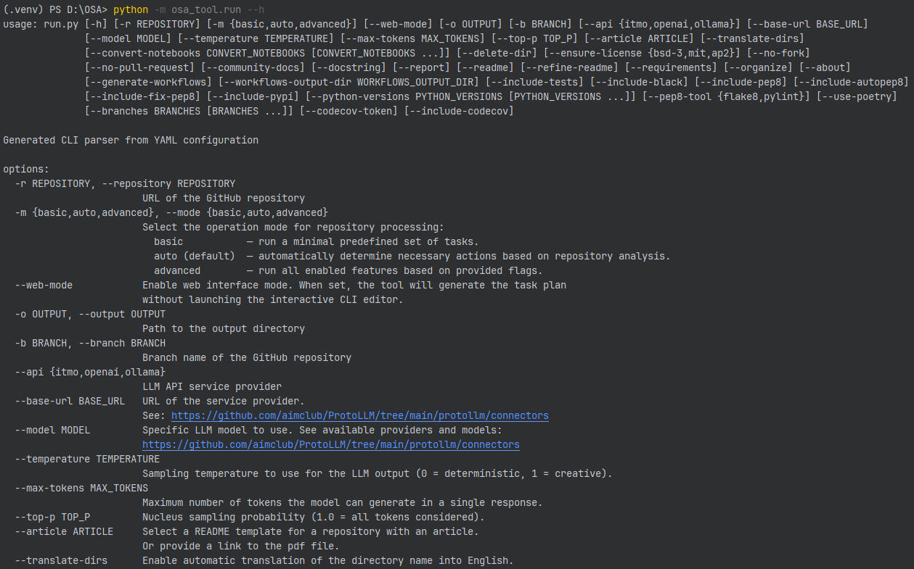
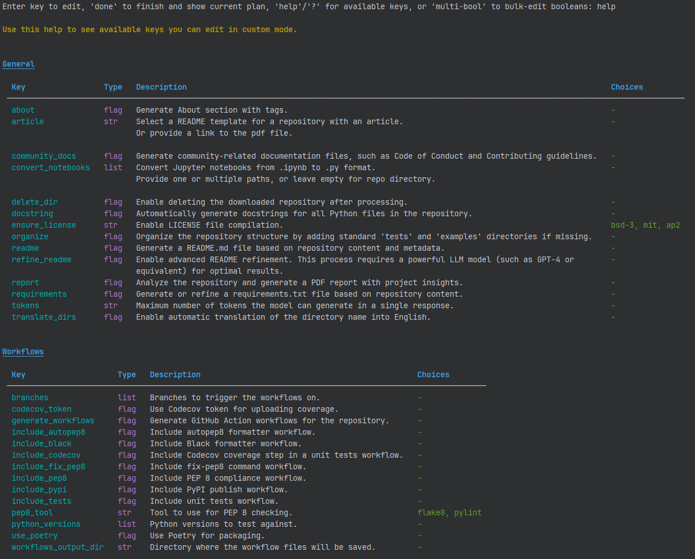

## Run Examples

This file contains commands to run the project scripts and links to the processed repositories.

**<!-- TODO: Add example commands and links to processed repositories -->**

### Example 1: Display Help Information

#### On the starting CLI

Command to run:

```sh
python -m osa_tool.run --help
```

Result:



#### On custom mode



### Example 2:

**Command to run:**

```sh
python -m osa_tool.run -r [repo_url] ...
```

**Screenshot of CLI:** Add a terminal screenshot here if this run involved modifications using the PlanEditor or
demonstrates unique scheduling behavior.

**Result:** processed repository url