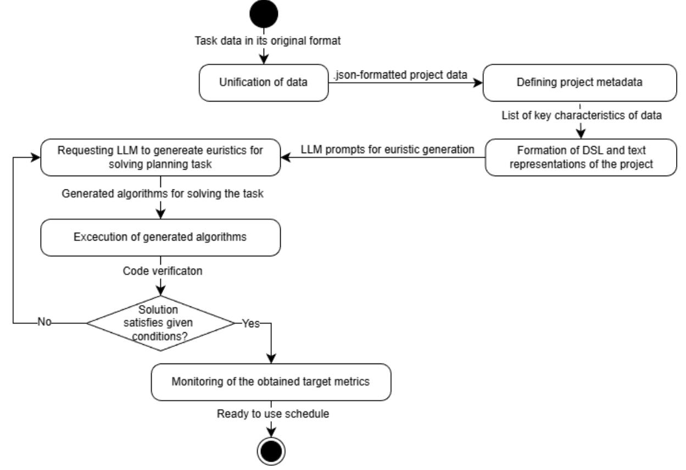

#### **Министерство науки высшего образования Российской Федерации ФЕДЕРАЛЬНОЕ ГОСУДАРСТВЕННОЕ АВТОНОМНОЕ ОБРАЗОВАТЕЛЬНОЕ УЧРЕЖДЕНИЕ ВЫСШЕГО ОБРАЗОВАНИЯ**

# **«НАЦИОНАЛЬНЫЙ ИССЛЕДОВАТЕЛЬСКИЙ УНИВЕРСИТЕТ ИТМО» (Университет ИТМО)**

**Факультет** технологий искусственного интеллекта

**Образовательная программа** Искусственный интеллект в промышленности

**Направление подготовки (специальность)** 09.04.02 - Информационные системы и технологии

# **О Т Ч Е Т**

по научно-исследовательской работе

Тема: От DSL к эвристикам: генерация правил приоритета для базового GA/SGS с минимальной диалог-стоимостью

Студент: Михалева С.Д., группа J4151

Научный руководитель: Ковальчук Михаил Андреевич

# СОДЕРЖАНИЕ

| Введение                                           | . 3 |
|----------------------------------------------------|-----|
| Глава 1. Аналитический обзор предметной области    | . 5 |
| 1.1. Постановки задач RCPSP и их решения           | . 5 |
| 1.2. Использование LLM для генерации эвристик кода | . 7 |
| 1.3. Выводы по главе                               | .9  |
| Глава 2. Разработка темы                           | 12  |
| 2.1. Постановка задания                            | 12  |
| 2.2 Алгоритм получения расписания при помощи LLM1  | 13  |
| 2.3. Набор данных задач планирования               | 14  |
| 2.4. Текстовое описание задач планирования         | 16  |
| 2.5. DSL описание задач планирования               | 17  |
| 2.6. Выводы по главе                               | 20  |
| Глава 3. Эксперименты                              | 21  |
| 3.1. Основные результаты                           | 21  |
| 3.2. План дальнейшего исследования                 | 22  |
| 3.3. Выводы по главе                               | 23  |
| Заключение                                         | 24  |
| Список использованных источников                   | 25  |

#### Введение

<span id="page-2-0"></span>Целью задач планирования проектов с ограниченными ресурсами (RCPSP) является минимизация продолжительности проекта (makespan) при соблюдении ограничений на ресурсы и последовательности выполнения работ [1]. Существуют множество постановок таких задач, отражающие реальные производственные условия: многорежимность работ, начисление штрафов за опоздание и т.д.

Современные методы оптимизации, которые будут рассмотрены далее в отчете, эффективны только в рамках одной вариации задачи планирования. Адаптация алгоритма под новые ограничения требует полной переработки программного кода и привлечения профильных экспертов.

В свою очередь развитие больших языковых моделей (LLM) открыло новую возможность в генерации программного кода. Лингвистическая неоднозначность, возникающая при описании ограничений на естественном языке, часто может приводить к созданию некорректного кода. В связи с этим, актуальным становится переход от естественно-языкового описания к предметно-ориентированным языкам (DSL) для формализации метахарактеристик проекта.

Цель работы заключается в повышении эффективности генерации эвристик для задач планирования путем минимизации количества итераций взаимодействия с LLM и объема передаваемого ей контекста с сохранением качества генерируемых расписаний.

Для достижения поставленной цели необходимо решить следующие задачи:

- Провести анализ предметной области RCPSP;
- Провести аналитический обзор по использованию LLM для генерации эвристик кода в задачах комбинаторной оптимизации;
- Разработать алгоритм получения расписания при помощи LLM на основе текстового и DSL описаний;

- Сформировать набор данных;
- Провести экспериментальное исследование.

Объект исследования – алгоритм генерации программного кода (эвристик) на основе структурированных описаний предметной области.

Предмет исследования – алгоритмы планирования.

Научная новизна работы заключается в разработке метода автоматизированной генерации эвристик, основанный на представлении структурных мета-характеристик проекта в формализованный DSL. В отличие от существующих подходов, использующих описания на естественном языке, внедрение формализованного DSL позволяет абстрагироваться от лингвистических особенностей запроса, снижая риск генерации невалидного кода.

Полученный подход может способствовать сокращению времени и ресурсов, необходимых для адаптации алгоритмов планирования под новые производственные условия, исключая необходимость ручной переработки кода. Это должно обеспечить гибкость систем поддержки принятия решений в управлении проектами.

# Глава 1. Аналитический обзор предметной области 1.1. Постановки задач RCPSP и их решения

<span id="page-4-1"></span><span id="page-4-0"></span>Задача планирования проекта с ограниченными ресурсами (RCPSP) представляет собой одну из наиболее широко изучаемых задач комбинаторной оптимизации в управлении проектами. С момента своей первоначальной формулировки в 1960-х годах RCPSP эволюционировала от простой задачи минимизации времени выполнения до задачи, охватывающей разнообразные, часто противоречащие друг другу цели [2]. Фундаментальная задача заключается в планировании проектных мероприятий с учетом отношений предшествования и ограниченной доступности ресурсов при одновременной оптимизации одного или нескольких критериев производительности.

В последние годы в исследованиях RCPSP наблюдается переход от одноцелевой многоцелевым оптимизации К структурам, которые одновременно учитывают несколько оценок расписания [2]. Эта эволюция отражает понимание того, что успех реального проекта не может быть адекватно оценен одной метрикой. Менеджеры проектов балансировать такие конкурирующие цели. как минимизация продолжительности проекта, снижение затрат, максимизация качества и снижение рисков [3].

RCPSP формулировки Расширенные значительно повышают реалистичность моделирования. Так, Yang et al. [4] рассмотрели двухцелевую проектов задачу планирования ограниченными ресурсами множественными режимами выполнения работ (MRCMPSP). сочетающий предложили инновационный подход, классический эволюционный алгоритм NSGA-II с методами обучения с подкреплением, а именно Q-learning. Интеграция Q-learning позволила динамически настраивать операторов, параметры генетических что существенно повысило эффективность поиска в пространстве решений и помогло избежать преждевременной сходимости. Апробация метода показала его превосходство над традиционными алгоритмами (PSO, ACO и стандартный NSGA-II) как по точности нахождения фронта Парето, так и по стабильности результатов в условиях жестких ресурсных ограничений.

В работе Gao et al. [5] был разработан итеративный жадный алгоритм с метавристической ориентацией в подходе локальной оптимизации для многорежимной задачи планирования с ограничениями по ресурсам в условиях неопределенности. Экспериментальное тестирование на наборах данных PSPLIB показало, что предложенный алгоритм значительно превзошел существующие метаэвристики по показателям робастности и стабильности.

Torba et al. [6] нашли решение комплексной практической задачи планирования проектов на реальных данных заводов по тяжелому техническому обслуживанию компании SNCF. Для решения задач большой размерности (до нескольких тысяч активностей) был предложен меметический алгоритм, сочетающий в себе гибридный генетический алгоритм и метод имитации отжига. В качестве целевых функций были выбраны минимизация суммы взвешенного опоздания проектов и минимизация их взвешенной длительности. Результаты экспериментов подтвердили высокую эффективность предложенного алгоритма, который продемонстрировал превосходство над популярными метаэвристическими подходами как на реальных производственных кейсах, так и на стандартных бенчмарках.

Ученые из Малайзии решили критическую проблему управления рисками, предложив модель компромисса между ожидаемой чистой приведенной стоимостью и условной стоимостью риска [7]. В отличие от классических подходов, длительность работ и денежные потоки рассматривались как случайные величины. Для решения задачи авторы разработали гибридный алгоритм, сочетающий генетический алгоритм с NSGA-II и метод имитации Монте-Карло. Практическая значимость исследования была подтверждена на примере проекта системы вентиляции и кондиционирования в цифровом парке Дунгуань.

Подводя итог обзора RCPSP подобных задач и их существующие подходы решения, можно сказать, что предметная область подвергается изменениям с целью обеспечить действительность производственных работ. Используемые методы метаэвристик и методов машинного обучения уже приносят значительное повышение эффективности планирования, но также заметны в них ряд недостатков:

- представленные решения строго ориентированы на конкретный тип задач;
- эффективность гибридных методов напрямую зависит от экспертного подбора параметров.

#### 1.2. Использование LLM для генерации эвристик кода

<span id="page-6-0"></span>Wang и Li классифицировали методы использования LLM в области исследования операций [8]. Они выделили три направления: автоматическое моделирование, вспомогательная оптимизация и прямое решение задач. Несмотря на существующие вызовы, обработка длинных контекстов и обеспечение надежности, интеграция LLM обозначит переход от ручного кодирования к сотрудничеству человека и искусственного интеллекта в решении задач управления производством и логистикой.

К примеру, в рамках фреймворка NS4S [9] большая языковая модель была адаптирована для управления поиском по окрестностям. Использование эволюции VeEvo позволило снизить эффект галлюцинаций модели и эффективно настроить веса операций в процессе локального поиска.

В области комбинаторной оптимизации для LLM нашли применение в роли генератора сложных эвристик. Wu et al. [10] представили алгоритм Hercules, использующий метод «Core Abstraction Prompting» (CAP). Этот подход позволил извлечь ключевые компоненты из успешных эвристик и на

их основе сгенерировать высокоэффективные правила для решения широкого класса комбинаторных задач. Еще один пример, метод генерации специфичных конкретной эвристик [11].Ученые ДЛЯ задачи продемонстрировали, что создание эвристических функций непосредственно из определений задач на языках программирования общего назначения позволяет обходить ручное генерирование доменно-независимых правил, достигая конкурентноспособных результатов в задачах AI Planning.

Qi et al. [12] представили меметический фреймворк, объединяющий эволюционный дизайн эвристик с механизмами рефлексии. Это позволило модели не просто генерировать код, но и анализировать результаты его исполнения для последующей корректировки.

Еще был проведен сравнительный анализ шести открытых больших языковых моделей в планировании задач в облачных вычислениях [13]. Использовался только формат естественного языка. Эксперименты показали, что LLM способна принимать адекватные решения в простых сценариях, но уступает специализированным методам сложных динамических сред. Это подтверждает необходимость разработки более комплексной архитектуры для получения более стабильных ответов.

Применение больших языковых моделей в задачах составления расписаний открыло новые возможности для создания адаптивных и интеллектуальных методов решения. Исследование таких перспектив было проведено Valmeekam et al. [14]. Анализ показал, что автономные способности современных моделей к логическому планированию все же остаются ограниченными. Это подчеркивает, что LLM чувствительна к формулировкам и демонстрирует слабость в долгосрочном планировании. Тем не менее, работа выделяет перспективное направление: использование LLM как источник эвристического руководства для классических алгоритмов поиска.

Переход от текстовых ответов к генерации исполняемого кода стал важным этапом в преодолении структурных ограничений моделей. В работе Singh et al. [15] представлен фреймворк ProgPrompt, который использует

программно-ориентированные промпты LLM для генерации планов действий роботов в условиях реальной среды. Данный подход позволил минимизировать синтез невыполнимых действий робота.

А разработка ReflecSched [16] смогла решить сложную задачу динамического гибкого планирования производственных операций (DFJSP) через иерархическую рефлексию. LLM выступила в роли стратегического анализатора, который на основе симуляций формирует стратегический опыт, направляя процесс принятия решений.

Проведенный обзор показывает, что большие языковые модели активно исследования операций, интегрируются задачи планирования комбинаторной Наибольшую эффективность LLM оптимизации. полностью автономном решении, демонстрирует не В роли интеллектуального компонента, усиливающего классические алгоритмы. Но большие языковые модели остаются чувствительны при ЭТОМ формулировкам, также им необходимо передавать объемный контекст. Это указывает на недостаточную проработанность методов компактного, формализованного взаимодействия с LLM и на отсутствие универсальных подходов, которые бы обеспечили высокое качество решений при снижении диалог-стоимости (количества токенов).

#### 1.3. Выводы по главе

<span id="page-8-0"></span>Для формирования целостного представления о текущем состоянии предметной области представлена таблица 1.

Название Снижение Применимость метода / Использование вычислительных в реальных Автор Тип задачи алгоритм LLM (динамических) метода затрат на оценку решения эвристик средах Torba et **MSRCMPSP** GA + SAНизкое Очень высокая al. [6]

Gao et

al. [5]

MM-RCPSP

Matheuristic

Табл. 1. «Сравнение существующий решений RCPSP подобных задач»

Высокое

Высокая

| <b>Автор</b> метода   | Тип задачи          | Название метода / алгоритм решения | Использование Вычислительных затрат на оценку эвристик |               | Применимость в реальных (динамических) средах |
|-----------------------|---------------------|------------------------------------|--------------------------------------------------------|---------------|-----------------------------------------------|
| Teh [7]               | Stochastic<br>RCPSP | GA + Monte<br>Carlo                | Частично                                               | Среднее       | Средняя                                       |
| Yang et al. [4]       | MRCMPSP             | NSGA-II +<br>Q-learning            | -                                                      | Среднее       | Высокая                                       |
| Zhang et al. [9]      | JSP                 | NS4S                               | +                                                      | Среднее       | Средняя                                       |
| Qi et al. [12]        | Heuristic<br>Design | Reflective                         | +                                                      | Очень высокое | Средняя                                       |
| Cao &<br>Yuan<br>[16] | DFJSP               | ReflecSched                        | +                                                      | Высокое       | Очень высокая                                 |

Из таблицы видно, что существует три вида систем планирования:

- 1. Классический в нем отсутствует LLM, но есть математические проработки и эвристические алгоритмы. Эта система надежна и применима в реальных средах, но при этом вычислительные затраты на поиск решения к новым ограничениям остаются высокими;
- 2. С применением машинного обучения внедрение Q-learning дает возможность алгоритмам подстраиваться под данные. Данный компонент снижает вычислительные затраты, но требует тщательной подготовки выборки для обучения;
- 3. С использованием больший языковых моделей в реальных средах LLM показывает лучшую адаптивность, благодаря способности учитывать контекст задачи, который трудно сформулировать в классических формулах. К тому же система с LLM способна понять логику планирования самостоятельно, что способствует лучшей гибкости в составлении расписаний на производстве.

Несмотря на успехи рассмотренных методов автоматизации планирования, они имеют несколько минусов:

• Избыточные итерационные циклы рефлексии, что ведет к высокой стоимости эксплуатации и задержкам в принятии решений;

 Использование естественного языка для описания сложных связей в задачах типа RCPSP может привести к галлюцинациям, что повлечет к генерации невалидного кода эвристик.

Таким образом, предлагаемая в данной работе концепция направлена на устранение этих недочетов за счет внедрения формализованного DSL. В нем подразумевается переход от неструктурированного текста к компактным метахарактеристикам проекта. Это должно позволить минимизировать объем контекста, передаваемого LLM, повысить надежность генерируемого кода и сократить количество итераций.

## Глава 2. Разработка темы

#### 2.1. Постановка задания

<span id="page-11-1"></span><span id="page-11-0"></span>Основная задача исследования заключается в автоматизации процесса формирования правил приоритета для решения задач планирования. Математически процесс получения расписания S можно представить как:

$$G(D) = SGS(D, f_{LLM}(M) \rightarrow S,$$

где D — пространство данных проекта, M — мета-характеристики проекта,  $f_{LLM}$  — функция языковой модели, преобразующая метра-описание а исполняемый код правил приоритета, SGS — схема генерации расписания (Schedule Generation Scheme), S — результирующее расписание.

Пространство данных описывается следующими параметрами:

- $J = \{0, 1, ..., n, n + 1\}$  множество работ, где 0 и n+1 являются фиктивными работами «Старт» и «Финиш»;
  - $d_i$  длительность работы  $j \in J$  ( $d_0 = d_{n+1} = 0$ );
  - $P_j \subset J-$  множество непосредственных предшественников работы j;
  - $\bullet$  K множество типов ресурсов;
  - $R_k$  доступный объем ресурса типа  $k \in K$  в каждый момент времени;
- $\bullet$   $r_{jk}$  потребность работы j в ресурсе типа k на протяжении всей ее длительности;
  - $S_{j}$  момент начала работы j;
  - $C_j = S_j + d_j$  момент окончания работы j.

Пространство признаков  $M = \{m_1, m_2, ..., m_p\}$  — вектор мета-характеристик проекта, а Enc:  $D \to M$  — это функция кодирования (извлечения характеристик) из полных данных проекта в краткое описание.

Пространство решений (генерация эвристик) характеризуется:

- П пространство возможных правил приоритета;
- $\pi \in \Pi$  конкретное правило для конкретного проекта;

- fLLM(M) = πgen процесс генерации правила моделью на основе описания проекта;
- SGS(D, π) → S алгоритм построения расписания, который на основе данных D и правила π выдает готовое расписание S.

Метрики результатов научно-исследовательской работы:

- fobj(S) → R качество расписания (например, Makespan);
- Cdialog стоимость диалога:
  - Niter количество итераций (промптов) до получения рабочего кода;
  - Lprompt суммарная длина переданных токенов.

## 2.2 Алгоритм получения расписания при помощи LLM

<span id="page-12-0"></span>Процесс формирования расписания с использованием больших языковых моделей (рис. 1) разделен на три ключевых этапа: формализация входных данных, генерация программного кода эвристики и исполнение алгоритма планирования.



Рис. 1. Система генерации расписаний на базе LLM.

На вход системы поступают данные о проекте D. С целью минимизации диалог-стоимости вместо полной спецификации работ выполняется извлечение мета-характеристик. На их основе формируется компактные описания задачи текстом и DSL.

На втором этапе LLM выступает в роли генератора программного кода. Модель выдает исполняемый код правила приоритета, который проходит проверку на синтаксическую корректность и валидность при работе с объектами исходных данных проекта.

На последнем шаге построения расписания эвристика рассчитывает метрики, которые служат критериями для решения задачи планирования.

#### 2.3. Набор данных задач планирования

<span id="page-13-0"></span>В таблице 2 представлены собранные для экспериментов постановки задач планирования.

Табл. 2. «Описание набора данных»

| Тип задачи                | Особенности<br>структуры                 | Ресурсная<br>специфика                                    | Ключевое отличие                                                                         |  |
|---------------------------|------------------------------------------|-----------------------------------------------------------|------------------------------------------------------------------------------------------|--|
| RCPSP                     | Жесткий граф<br>связей                   | 4 типа<br>возобновляемых<br>ресурсов                      | Проверка базовой способности модели соблюдать жесткие технологические циклы              |  |
| Single Machine (JIT)      | Нет связей (полная свобода порядка)      | 1 машина (емкость = 1), последовательное использование    | Тест на понимание<br>стоимостных функций и<br>генерацию стратегий<br>балансировки сроков |  |
| RCPSP<br>with NRR         | Условные связи (выбор альтернатив)       | Смешанные ресурсы (5 возобновляемые + 2 невозобновляемых) | Проверка логики «производства-потребления» и управления динамическим балансом ресурсов   |  |
| RCPSP<br>with RR          | Условные связи (выбор альтернатив)       | 5 типов<br>возобновляемых<br>ресурсов                     | Тест на анализ сложной топологии графа при критическом дефиците мощностей                |  |
| RCMPSP<br>(Multi-project) | Несколько<br>независимых<br>графов работ | 6 типов общих для всех проектов возобновляемых ресурсов   | Проверка навыков глобальной оптимизации и разрешения межпроектных конфликтов             |  |

Базовая задача RCPSP была взята из PSPLIB [17] в качестве эталонного теста календарного планирования с 30 работами. Особенность данного набора заключается в однорежимном выполнении каждой работы и использовании только четырех типов возобновляемых ресурсов.

Для проверки гибкости LLM в генерации стратегий балансировки была выбрана задача с общим директивным сроком (Common Due Date) [18]. В отличие от классического планирования, здесь отсутствуют связи предшествования, что дает полную свободу в выборе порядка работ. Но вводится сложная целевая функция: минимизация суммы штрафов за опережение и опоздание относительно срока.

Гибкое планирование с расширенными ресурсами (RCPSP with RR/NRR) [19] — данная группа задач представляет собой усложненные версии RCPSP, включающие смешанные типы ресурсов. Помимо возобновляемых учитываются невозобновляемые ресурсы. В отличие от фиксированного графа, в условном планировании LLM должна учитывать, что выполнение одной работы может исключать или открывать альтернативные пути в проекте.

Завершающим уровнем тестирования является задача многорежимного планирования [20], где необходимо составить единое расписание для нескольких независимых проектов. Ключевая сложность — наличие общих ресурсов, за которые конкурируют работы разных проектов.

Данная совокупность задач охватывает максимально широкий спектр сценариев планирования: от классических детерминированных структур до гибких систем с условной логикой и многопроектных сред с перекрестным распределением ресурсов. Такое разнообразие постановок должно доказать универсальность разработанного DSL описания и подтвердить, что использование LLM для генерации эвристик не ограничивается узким классом задач, а масштабируется на сложные промышленные кейсы.

## 2.4. Текстовое описание задач планирования

<span id="page-15-0"></span>Для того чтобы протестировать результативность языковой модели в интерпретировании мета-характеристик и преобразовании их в программный код, был разработан специализированный шаблон текстового описания.

## Структура разработанного шаблона:

It is required to schedule a project belonging to the **[problem class: RCPSP / RCMPSP / JIT]**, consisting of **[number]** activities. The primary optimization objective is to **[minimize makespan / minimize total weighted earliness–tardiness penalties / combined objective]**.

The activities are subject to precedence constraints forming **[a single directed acyclic graph / multiple independent DAGs / a set of independent jobs]**. The project includes precedence relations of the Finish–Start type (and, if applicable, other relations such as Start–Start or Finish–Finish), potentially with time lags. These constraints impose a **[moderately constrained / tightly constrained]** temporal structure on the schedule.

The project utilizes **[number]** types of resources, which are **[renewable / mixed: renewable and non-renewable]**. Resource availability is **[balanced / scarce]**, indicating **[low / high]** resource contention during execution. The input data may additionally include **[non-renewable resource budgets / hard deadlines / due dates / time lags]**, which must be respected by the scheduling algorithm.

To obtain a high-quality schedule, the solution method should primarily focus on **[time-oriented / resource-oriented]** decisionmaking. When selecting the next activity to schedule, priority should be given to activities that **[e.g., have the smallest latest finish time, highest resource demand, minimum slack, or highest penalty impact]**, as this is expected to better align with the structural characteristics of the project and the optimization objective.

Based on the above project characteristics, generate Python code that implements the selected scheduling heuristic. The code must define a function:

#### **def solve\_project(json\_data) -> Dict:**

The function should: parse the input data dynamically according to the provided project structure; construct a feasible schedule satisfying all precedence and resource constraints; return the result in the form **Dict(schedule={activity\_id: start\_time}, metrics={makespan, total\_penalty, execution\_time})**; and measure the **algorithm's execution time**.

#### 2.5. DSL описание задач планирования

<span id="page-16-0"></span>Для минимизации объема передаваемых данных и устранения лингвистической двусмысленности в работе был разработан предметно-ориентированный язык на базе формата JSON. Этот язык послужил сжатым представлением задач планирования, передавая LLM не полный список всех работ, а их агрегированные характеристики, логику ограничений к программной реализации.

На рисунке 2 представлен блок, который классифицирует задачи планирования и структуру связей между ними.

```
"meta_problem_definition": {
    "problem_class": "STRING (Standard RCPSP, RCMPSP [Multi-Project], Single
    Machine [JIT], RCPSP with NRR/RR)",
    "topology": {
        "structure": "STRING (Single DAG, Multiple Independent DAGs, Independent
        Jobs [No Predecessors])",
        "is_multiproject": "BOOLEAN (True if jobs are nested in projects)",
        "constraints_type": ["Finish-Start", "Resource Capacity",
        "Deadline/Due-Date"]
    }
},
```

Рис. 2. Определение класса и топологии задач планирования.

В данном разделе устанавливается теоретическая принадлежность проектов, отделяя стандартные формулировки от многопроектных сред или задач для одной машины. Здесь же фиксируется топология графа работ с их структурой связей, а также определяются типы ограничений, включая временные зависимости и лимиты мощностей.

Целевая направленность планирования описывается в разделе «optimization\_criteria» (рис. 3).

Рис. 3. Определение цели проекта.

Выше представленный блок задает тип целевой функции, передает возможные параметры работ проекта. Совместно с этим, блок «resource\_logic» (рис. 4) определяет категории доступности ресурсов.

Рис. 4. Типы ограничений на ресурсы.

Отличительная от текстового описания задач и более универсальная черта DSL представления заключается в части извлечения информации по структуре дальнейшего входного файла в алгоритм решения (рис. 5). Для этого специально была проведена формализация всех наборов данных для тестирования.

Рис. 5. Универсальная карта парсинга для входных данных.

Завершающий этап описания представляет собой алгоритмическое задание для модели (рис. 6).

Рис. 6. Инструкции для генерации кода на Python.

Данный блок предоставляет LLM возможность выбора стратегии решения. При этом модель должна самостоятельно сконструировать правило приоритетов на основе предоставленных метаданных.

#### 2.6. Выводы по главе

<span id="page-19-0"></span>В рамках данной главы была поставлена и формализована задача автоматизации процесса формирования правил приоритета для решения RCPSP подобных задач.

Представлен трехэтапных алгоритм получения расписания с использованием LLM, в который входит структурирование входных данных, генерация программного кода эвристики и исполнение алгоритма планирования.

Для комплексного тестирования разработанного подхода был сформирован набор задач планирования с разными постановками, включающие различные ограничения проектов.

Были разработаны два формата описания задач планирования: текстовый и предметно-ориентированный язык на базе JSON. Текстовое представление, основанное на специализированном шаблоне, позволяет LLM интерпретировать структуру проекта, ограничения и целевые функции, генерируя соответствующий Python-код. DSL в свою очередь обеспечивает более сжатое описание задач, передавая модели агрегированные характеристики и инструкции для генерации кода.

В данной главе была заложена практическая основа для разработки системы автоматизированного формирования правил приоритета для решения задач планирования с использованием больших языковых моделей.

# Глава 3. Эксперименты 3.1. Основные результаты

<span id="page-20-1"></span><span id="page-20-0"></span>Основной целью экспериментов выступило сравнение качества и стабильности генерируемых расписаний при использовании двух способов представления мета-характеристик проектов: неструктурированное текстовое описание и формализованный предметно-ориентированный язык в формате JSON.

Эксперименты были проведены с применением большой языковой модели Gemini 1.5 Flash. Полученные результаты представлены в таблице 3.

Табл. 3. «Итоговые показатели экспериментов»

|                      |                                                              | RCPSP  | Single<br>Machine | RCPSP<br>with NRR | RCPSP<br>with RR | RCMPSP  |
|----------------------|--------------------------------------------------------------|--------|-------------------|-------------------|------------------|---------|
| Текстовое описание   | Makespan<br>/<br>Total Penalty                               | 43,67  | 27392             | 112,6             | 46,67            | 88      |
|                      | Время выполнения,<br>мс                                      | 0,5612 | 2,2186            | 1316,48           | 7,8884           | 17,6508 |
|                      | проекта<br>Количество<br>итераций<br>взаимодействия с<br>LLM | 5,3    | 4,3               | 4,3               | 3,67             | 2,3     |
|                      | Среднее количество<br>токенов на запрос в<br>LLM             | 294,3  | 210,91            | 319,67            | 290,7            | 338,6   |
| DSL описание проекта | Makespan<br>/<br>Total Penalty                               | 46     | 27392             | 77                | 115,67           | 88      |
|                      | Время выполнения,<br>мс                                      | 0,2575 | 1,0023            | 0,9195            | 1,2340           | 0,6669  |
|                      | Количество<br>итераций<br>взаимодействия с<br>LLM            | 3      | 2                 | 2,7               | 2,3              | 2       |
|                      | Среднее количество<br>токенов на запрос в<br>LLM             | 243,5  | 156,4             | 294,43            | 310,4            | 260,57  |

По итогам экспериментов, представленных в таблице, можно сделать следующие выводы:

- 1. Использование DSL-описания позволило сократить количество итераций взаимодействия с моделью для получения рабочего кода. В ряде случаев это сокращение достигало 2 раз, а для некоторых задач до 6 раз;
- 2. В отличие от текстового описания, где в некоторых случаях был получен невалидный Makespan, использование DSL гарантировало генерацию более корректных решений;
- 3. Гипотеза о снижении объема передаваемого контекста при использовании DSL подтвердилась;
- 4. В случаях, когда оба метода (DSL и текстовое описание) демонстрировали идентичное среднее значение Makespan, DSL-подход делал это быстрее и с меньшим числом итераций, что подтверждает его преимущество в общей эффективности;
- 5. Эвристики, сгенерированные на основе DSL, демонстрирует меньшее время выполнения, что указывает на синтез более оптимизированного программного кода.

#### 3.2. План дальнейшего исследования

<span id="page-21-0"></span>Для развития предложенного метода и повышения его универсальности были определены такие направления дальнейшей работы:

- 1. Планируется включение дополнительных параметров для учета специфических производственных ограничений. Новые элементы DSL будут базироваться на анализе расширенных данных;
- 2. Проведение сравнительного тестирования эффективности DSL на различных архитектурах больших языковых моделей позволит оценить универсальность подхода;
- 3. Проведение серии повторных экспериментов для вычисления средних значений метрик. Такая мера необходима для нивелирования фактора стохастичности, который характерен процессу генерации кода LLM;

4. Подготовка научной статьи по итогам работы. В публикации будет подробно описана архитектура разработанного языка и его влияние на диалогстоимость и качество генерации эвристик.

# 3.3. Выводы по главе

<span id="page-22-0"></span>В рамках третьей главы было проведено экспериментальное исследование разработанного алгоритма генерации эвристик с использованием Gemini 1.5 Flash. Апробация подхода на пяти типах задач планирования подтвердила работоспособность предложенного метода.

Сравнительный анализ показал, что переход от текстовых описаний к DSL позволил снизить диалог-стоимость за счет сокращения объема входных токенов и уменьшения количества итераций до получения валидного кода. Впрочем, в некоторых наблюдениях количество токенов все же больше, это связано с тем, что в DSL формулировке осуществлена возможность передачи структуры данных самой задачи, чтобы в предложенном LLM коде были необходимые названия переменных.

## Заключение

<span id="page-23-0"></span>В данной научно-исследовательской работе была рассмотрена актуальная проблема автоматизации формирования правил приоритета для задач планирования проектов с ограниченными ресурсами с использованием больших языковых моделей. Основное внимание было направлено на переход от традиционного естественно-языкового описания задач к использованию формализованного предметно-ориентированного языка на базе JSON для минимизации диалог-стоимости и повышения стабильности генерации программного кода.

В ходе работы были успешно выполнены поставленные задачи:

- Проведен анализ предметной области и существующих методов их решения;
- Выполнен аналитический обзор использования LLM в задачах комбинаторной оптимизации;
- Разработан алгоритм получения расписания, включающий формализацию данных, генерацию кода эвристики LLM и исполнение алгоритма планирования;
- Сформирован репрезентативный набор данных, охватывающий разные постановки RCPSP подобных задач;
- Проведено экспериментальное исследование, в котором сравнивались текстовое и DSL описания мета-характеристик проектов.

Результаты исследования подтвердили достижение поставленной цели. Внедрение разработанного предметно-ориентированного языка позволило оптимизировать процесс взаимодействия с LLM по нескольким метрикам: была уменьшена диалог-стоимость запросов и достигнута высокая стабильность работы генерируемых алгоритмов.

## Список использованных источников

- <span id="page-24-0"></span>1. Artigues C., Hartmann S., Vanhoucke M. Fifty years of research on resource-constrained project scheduling explored from different perspectives //European Journal of Operational Research. – 2025.
- 2. Khajesaeedi S. et al. Resource-constrained project scheduling problem: Review of recent developments //International Journal of Project Management. – 2025. – Т. 10. – №. 1. – С. 1-26.
- 3. Zohrehvandi M. et al. A multi-objective mathematical programming model for project-scheduling optimization considering customer satisfaction in construction projects //Mathematics. – 2024. – Т. 12. – №. 2. – С. 211.
- 4. Yang H. et al. Bi-objective multi-mode resource-constrained multiproject scheduling using combined NSGA II and Q-learning algorithm //Applied Soft Computing. – 2024. – Т. 152. – С. 111201.
- 5. Gao Z. et al. A matheuristic-oriented iterated greedy algorithm for multi-mode resource-constrained project scheduling problem under uncertainty //Computers & Industrial Engineering. – 2024. – Т. 193. – С. 110333.
- 6. Torba R. et al. Solving a real-life multi-skill resource-constrained multiproject scheduling problem //Annals of Operations Research. – 2024. – Т. 338. – №. 1. – С. 69-114.
- 7. Teh S. Y. A CNPVaR–NPV trade-off model for resource-constrained project scheduling problem under random environment // International Journal of Electrical and Electronic Engineering and Telecommunications. – 2024. – Vol. 13, No. 6. – P. 478–485.
- 8. Wang Y., Li K. Large language models in operations research: Methods, applications, and challenges // arXiv preprint. – 2025. – arXiv:2509.18180.
- 9. Zhang J., Luo C., Su Z., Zhang Q., Lü Z., et al. NS4S: Neighborhood search for scheduling problems via large language models // Proceedings of the International Joint Conference on Artificial Intelligence. – 2025.
- 10. Wu X., Wang D., Wu C., Wen L., Miao C., et al. Efficient heuristics generation for solving combinatorial optimization problems using large language models // Proceedings of the 31st ACM SIGKDD Conference on Knowledge Discovery and Data Mining. – 2025. – Vol. 2.

- 11. Tuisov A., Vernik Y., Shleyfman A. LLM-generated heuristics for AI planning: Do we even need domain-independence anymore? // arXiv preprint. – 2025. – arXiv:2501.18784.
- 12. Qi F., Wang T., Zheng R., Li M. A memetic and reflective evolution framework for automatic heuristic design using large language models // Applied Sciences. – 2025.
- 13. Li, Mengjuan, Zhengguang Chen, Huan Zhou, Zhipeng Wang, Yingwen Chen , et al. Can LLMs only talk? Experimental studies on task scheduling with large language models // Proceedings of the International Conference on Computer Communications and Networks. – 2025.
- 14. Valmeekam, K. et al. On the planning abilities of large language models: A critical investigation // Advances in Neural Information Processing Systems. – 2023. – Vol. 36. – P. 75993–76005.
- 15. Singh, Ishika, Valts Blukis, A. Mousavian, Ankit Goyal, Danfei Xu, et al. ProgPrompt: Generating situated robot task plans using large language models // Proceedings of the IEEE International Conference on Robotics and Automation. – 2022.
- 16. Cao, Shijie, and Yuan Yuan. ReflecSched: Solving dynamic flexible job-shop scheduling via LLM-powered hierarchical reflection // arXiv preprint. – 2025.
- 17. Project scheduling problem library PSPLIB URL: [https://www.om](https://www.om-db.wi.tum.de/psplib/getdata_sm.html)[db.wi.tum.de/psplib/getdata\\_sm.html](https://www.om-db.wi.tum.de/psplib/getdata_sm.html)
- 18. OR-Library: Scheduling Problems URL: <https://people.brunel.ac.uk/~mastjjb/jeb/orlib/schinfo.html>
- 19. 4TU.ResearchData: Project Scheduling Dataset URL: <https://data.4tu.nl/datasets/8051d18f-a408-4661-84e4-a503ccd3b1b7/2>
- 20. Operations Research and Scheduling research group URL:

[https://www.projectmanagement.ugent.be/research/project\\_scheduling/RCMPSP](https://www.projectmanagement.ugent.be/research/project_scheduling/RCMPSP)