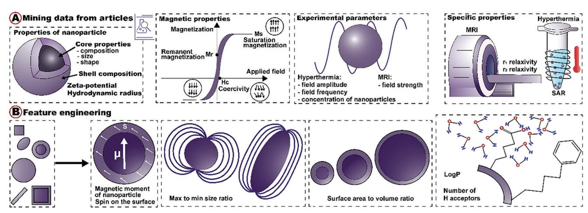
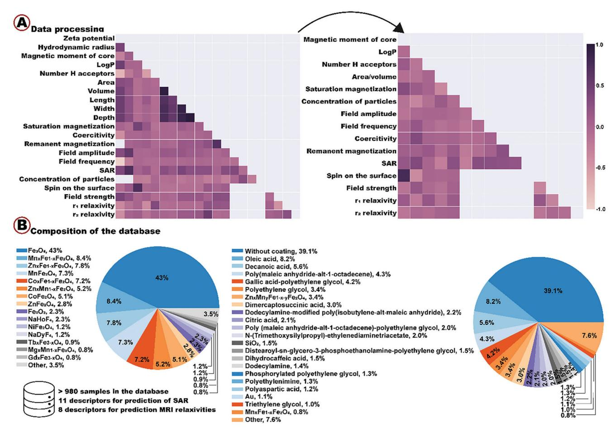
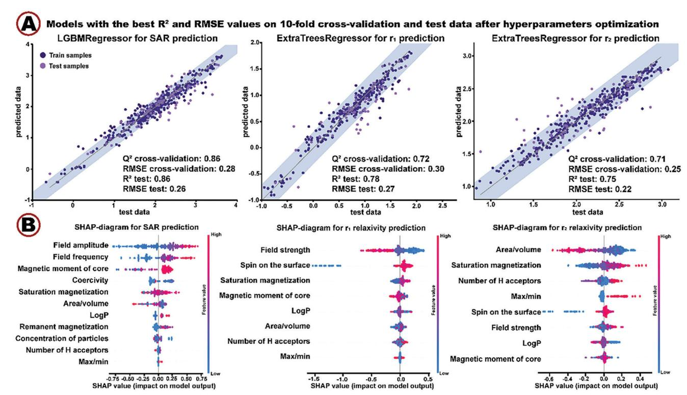
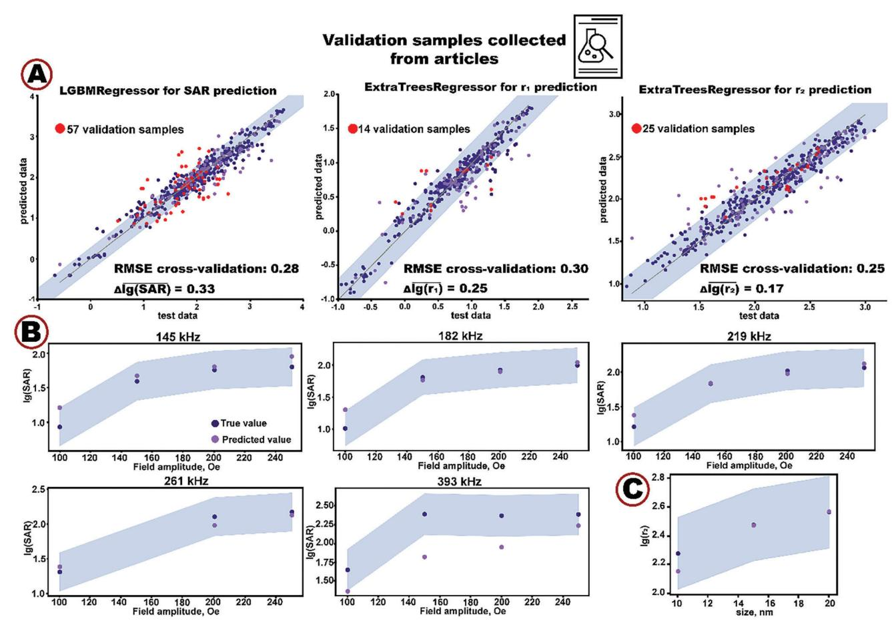
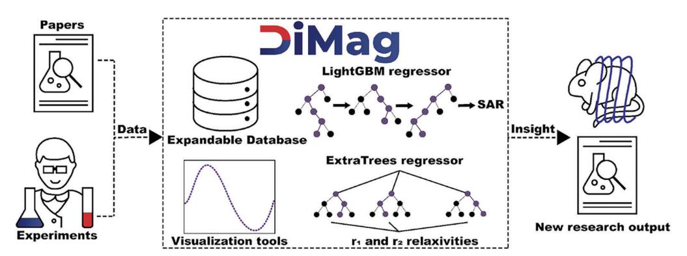

# **Quantifying the Efficacy of Magnetic Nanoparticles for MRI and Hyperthermia Applications via Machine Learning Methods**

*Pavel Kim, Nikita Serov, Aleksandra Falchevskaya, Ilia Shabalkin, Andrei Dmitrenko, Daniil Kladko,\* and Vladimir Vinogradov\**

**Magnetic nanoparticles are a prospective class of materials for use in biomedicine as agents for magnetic resonance imagining (MRI) and hyperthermia treatment. However, synthesis of nanoparticles with high efficacy is resource-intensive experimental work. In turn, the use of machine learning (ML) methods is becoming useful in materials design and serves as a great approach to designing nanomagnets for biomedicine. In this work, for the first time, an ML-based approach is developed for the prediction of main parameters of material efficacy, i.e., specific absorption rate (SAR) for hyperthermia and r1/r2 relaxivities in MRI, with parameters of nanoparticles as well as experimental conditions as descriptors. For that, a unique database with more than 980 magnetic nanoparticles collected from scientific articles is assembled. Using this data, several tree-based ensemble models are trained to predict SAR, r1 and r2 relaxivity. After hyperparameter optimization, models reach performances of R2 = 0.86, R2 = 0.78, and R2 = 0.75, respectively. Testing the models on samples unseen during the training shows no performance drops. Finally, DiMag, an open access resource created to guide synthesis of novel nanosized magnets for MRI and hyperthermia treatment with machine learning and boost development of new biomedical agents, is developed.**

# **1. Introduction**

Nanosized ferromagnets are an important class of materials whose magnetic properties such as magnetization values or coercivity are highly dependent on their size, shape, surface, and composition.[1] These unique properties of magnetic nanoparticles are pivotal for catalysis,[2] spintronics,[3,4] ecology,[5] data storage,[6] and medicine.[7–10] Medical treatments using magnetic nanoparticles have already shown promising results in clinical

P. Kim, N. Serov, A. Falchevskaya, I. Shabalkin, A. Dmitrenko, D. Kladko, V. Vinogradov

International Institute "Solution Chemistry of Advanced Materials and Technologies"

ITMO University

St. Petersburg 191002, Russian Federation

E-mail: kladko@scamt-itmo.ru; vinogradov@scamt-itmo.ru

The ORCID identification number(s) for the author(s) of this article can be found under https://doi.org/10.1002/smll.202303522

**DOI: 10.1002/smll.202303522**

practice.[11] As an example, Feridex and Resovist have been approved as magnetic resonance imagining (MRI) contrast agents for liver imagining. A number of other magnetic nanoparticles for MRI have undergone different stages of clinical trials.[12] The main reason for using magnetic nanoparticles as MRI contrast agents is that high-resolution images of different tissues enable accurate lesion detection.[13] Moreover, magnetic nanoparticles have recently been used in clinical trials for hyperthermia treatment of glioblastoma, prostate, and pancreatic cancer. Under high temperature, cells undergo heat stress, so apoptosis, signal transduction, and protein expression can be controlled.[14,15] However, the tedious process of synthesis of nanoparticles with satisfactory power loss for hyperthermia treatment and T1–T2 dual mode MRI contrast agents with high biocompatibility is limiting their biomedical applications.[11,14,16] Although size, shape, surface, and composition of nanoparticles and parameters of applied electromagnetic field can be optimized, selecting the

best combination of independent parameters is often infeasible in practice due to low throughput and lack of resources.[17–19]

There are several works attempting to build phenomenological models that simplify optimization processes by establishing relationships between the structure and the specific properties of magnetic nanoparticles.[20–22] Vuong et al. showed that r2 relaxivity positively correlates with the diameter of spherical iron oxide nanoparticles below the size limit of Motional Averaging Regime.[23] Shape of nanoparticles determines magnetic anisotropy, while surface modification affects the behavior of nanoparticles inside an aqueous environment, thus influencing interactions with water molecules that is critical for MRI and hyperthermia treatment, as well as biocompatibility.[21,24] However, these structure–property associations refer to rather special cases, not generally applicable to other systems since they do not take into account other parameters of the system. For example, size effects on relaxivity in MRI were shown to be connected to nanoparticle composition.[16] In this case, theoretical models using fundamental principles of physical processes could be helpful for estimating performance of magnetic **www.advancedsciencenews.com www.small-journal.com**

16136829, 2023, 48, Downloaded from https://onlinelibrary.wiley.com/doi/10.1002/smll.202303522 by ITMO University, Wiley Online Library on [10/07/2025]. See the Terms and Conditions (https://onlinelibrary.wiley.com/terms-and-conditions) on Wiley Online Library for rules of use; OA articles are governed by the applicable Creative Commons License

nanoparticles, i.e., Solomon–Bloembergen–Morgan theory and quantum mechanical outer sphere theory describing MRI relaxation processes;[16,17] linear response theory, the Rayleigh, and the Stoner–Wohlfarth models that analytically determine specific absorption rate (SAR) to quantify the efficacy of magnetic nanoparticles in converting electromagnetic energy into heat for hyperthermia applications.[25,26] However, these models cannot account for all characteristics of real systems such as surface coating composition, shape, single- or multidomain of magnetic nanoparticles, magnetic dipole interactions, as well as varying experimental conditions.[17,25,27,28] To do that, significant extension of theoretical models would have been necessary, which, in turn, would increase their complexity and the demand for compute.[29]

Machine learning (ML) methods can overcome the aforementioned limitations by leveraging large amounts of data. ML algorithms use training data to learn complex dependencies between sample features and its properties of interest bypassing explicit mathematical formulation of their relationship. Notably, this approach can also be computationally more efficient compared to numerical methods in mathematical modeling.[30] ML tools have been successfully used in materials science for predicting properties of nanomaterials and even de novo design.[31–34] Although there is an increasing demand for magnetic nanoparticles with specific properties for the best performance in different applications, there are relatively few works dedicated to ML targeting new materials in this domain.[35] Court et al. developed magnetocaloric property prediction models using the chemical composition features for predicting Curie temperature, absolute magnetic entropy change, and relative cooling power and applied these models for inverse design of materials.[36] Exl et al. applied an ML approach to study microstructural features of Nd2Fe14B permanent magnets with a granular structure and demonstrated importance of the position of the grain within the magnet.[37] Nelson and Sanvito used chemical composition as the only feature for prediction of the Curie temperature of ferromagnets with an accuracy of ≈50 K.[38] Coïsson et al. leveraged data of numerical simulations to predict power losses of magnetic nanoparticles for hyperthermia applications in good agreement with experimental data.[29] ML methods possess huge potential for designing magnetic nanoparticles for medical applications that have not yet been fully explored.[19]

In this work, we propose an ML approach to predict the parameters determining efficacy of nanoparticles in MRI (r1 and r2 relaxivities) or hyperthermia treatment (SAR). For this purpose, we create a unique database with physicochemical characteristics and measures of SAR and relaxivities by collecting data from the previously published articles. We perform feature engineering, train and optimize ML models to achieve tenfold cross-validation R2 = 0.86 for prediction of SAR, R2 = 0.78 and R2 = 0.75 for prediction of r1 and r2 relaxivities, respectively. We analyze feature importances using SHAP-values and map them onto the expected dependencies (those in agreement with previously reported experiments) between descriptor and target variables in the data to assess interpretability of our models. Thereby, we confirm a high degree of correspondence between the model predictions and the existing empirical evidence, which increases the confidence in the predictions of SAR and r1/r2 relaxivities. Moreover, we validate the ML models on previously unseen nanoparticles collected independently of the initial database and show accurate predictions of their properties, which makes a case for the use of our models in experimental practice. Finally, we present DiMag, a web service for rapid in silico screening of magnetic nanoparticles for biomedical applications, which provides users worldwide with access to the database and the trained ML models.

# **2. Results and Discussion**

## **2.1. Database of Magnetic Nanoparticles for Hyperthermia Treatment and MRI Diagnosis**

MRI is one of the main in vivo imaging tools able to provide both anatomical and functional information. In turn, hyperthermia is a kind of treatment frequently employed in cancer therapy. Thus, a combination of these approaches delivers hyperthermia treatment based on precise lesion diagnosis with MRI. Magnetic nanoparticles have unique properties and attract a lot of attention because of their potential use as MRI contrast agents for substitution of high-toxic Gd-chelates. Moreover, magnetic nanomaterials can be used as heating agents for hyperthermia treatment as they are able to convert large amounts of energy of alternating magnetic fields into heat. Despite a lot of attention to magnetic nanoparticles for biomedical applications, however, there are currently no databases of nanomagnets for MRI and hyperthermia treatment. Therefore, we set out to create such a database following the so-called FAIR principles[39] to accelerate the development of new materials and simplify the use of artificial intelligence to distill new scientific knowledge from data.

For this purpose, first, we manually collected 1282 raw samples from 126 unique scientific articles (Table S1, Supporting Information) with descriptions of synthesis, materials characterizations, and measurements of magnetic hyperthermia and MRI performances in vitro. Initial database consisted of various parameters playing a significant role in MRI and hyperthermia applications according to the physical nature of the process. Those include chemical composition of core, shape, length, width, depth, zeta potential, hydrodynamic radius, magnetic parameters of nanoparticles measured by SQUID under 300 K, parameters of magnetic field during experiments, concentration of nanoparticles and efficacy of nanomagnets in hyperthermia treatment (SAR value) and MRI (r1 and r2 relaxivities) obtained via in vitro experiments. Since it is known that surface composition defines the properties of magnetic nanoparticles to a large extent, we used inorganic shell and organic coating compositions to describe the surface of nanoparticles (**Figure 1**A).[17,20]

To go beyond collection of what had been readily available in the literature and enable broader downstream applications, we substantially expanded the set of characteristics of magnetic nanoparticles by feature engineering (Figure 1B). Average magnetic moment of metals in the core was calculated using magnetic moments of each element with help of stoichiometry to better describe composition of nanoparticles (Equation (S1), Supporting Information). Average spin of metal elements on the surface was obtained to describe interactions between the surface elements and proton spins responsible for relaxation properties of the nanoparticle (Equation (S2), Supporting Information). To describe the role of organic coating, we employed a partition coefficient LogP and number of H acceptors, which were calculated

**Figure 1.** Database formation. A) Examples of descriptors mined from the scientific articles. B) Examples of engineered features based on core and shell composition as well as geometry of nanoparticles.

using SMILES representations of organic molecules. These parameters could be informative of interactions of the surface of the nanoparticle with water molecules, and such interactions are known to have strong influence on the nanoparticle performance in MRI and magnetic hyperthermia.[40,41] Volume and surface area were calculated using the shape and size of the nanoparticle to describe morphological characteristics of nanomagnets.

All obtained and engineered features can be divided into specific groups that cover main aspects regarding behavior of nanoparticles in MRI and hyperthermia applications: 1) parameters reflecting the composition of nanoparticles (e.g., average magnetic moment of the metals), 2) parameters describing behavior of nanoparticles in aqueous environment (e.g., average spin of metal elements at the surface, zeta potential, hydrodynamic radius, number of H acceptors, and LogP of organic coating molecules), 3) parameters representing the structure of particles (e.g., such as area, volume, length, width, and depth), 4) SQUID-parameters (e.g., coercivity, remanence, and saturation magnetization reflecting magnetic properties of material), and 5) experimental conditions (e.g., field strength, amplitude, and frequency, concentration of nanoparticles). To investigate redundancy in these groups of features, we calculated and analyzed the Pearson correlation matrix (**Figure 2**A). We observed, for instance, a group of geometrical features with high cross-correlations and reduced them to a single area-volume feature. On the other hand, we investigated the number of outliers and missing values to keep only the most informative features.

After minimal data cleansing, we obtained the dataset of more than 980 nanosized metals, bimetals, and metal oxides (ferrites with various compositions) materials with more than 120 core and 50 shell compositions of different kinds. Figure 2B illustrates the broad coverage of nanoparticles in the final dataset. Ferrites, being the most well studied class of magnetic nanoparticles, are also the most represented one. The majority of magnetic nanomaterials have organic or inorganic shells of a wide range of compounds. The broad coverage of magnetic nanoparticles is especially important for downstream ML applications to avoid overfitting and improve generalization capabilities of the models.

In the following section, we use the resulting dataset to quantify the efficacy of magnetic nanoparticles in MRI and hyperthermia treatment with machine learning. However, we intend to expand the initial database and keep it up-to-date to allow broader use cases for fundamental research and biomedical applications.

#### **2.2. Prediction of SAR and Relaxivity Values of Magnetic Nanoparticles**

We aimed at predicting SAR and r1/r2 relaxivities based on the unique database of magnetic properties of nanoparticles described earlier. We started by implementing additional preprocessing steps to ensure high quality of the input data. Due to poor characterization of magnetic nanoparticles in the majority of scientific articles, which served as data sources for our study, it was impossible to effectively use all the collected descriptors. For example, zeta potential and hydrodynamic radius are important parameters describing the interaction between a nanoparticle and a media. Even so, we had to exclude them due to the large percent of missing values (*>*50%). Keeping those would require data imputation, which at this scale would inevitably introduce strong biases and decrease performance of ML models. As for other parameters (those having less data sparsity), we chose kNN imputation technique, because it considers the relationships between the different features, it is robust to outliers, and it can handle both categorical and continuous variables.[42] In the initial dataset, we had features with high percentages of missing values, e.g., 34% for r1 relaxation, 28% for remanent magnetization, and 21% for coercivity. To cope with that, we first removed the total of 211 samples such that each sample in the remaining dataset had no more than 15% of missing values. After that, we applied the kNN imputation algorithm to fill the gaps and obtain the complete dataset.

Further, to alleviate redundancy in data and retain only the most informative features, we transformed highly correlated geometrical features into area to volume and max to min length ratios reflecting size and shape anisotropy of nanoparticles. Correlation analysis confirmed the absence of linear dependencies

**Figure 2.** A) Correlation matrix for the initial and the selected parameters (empty region indicates there is no intersection between the parameters, so correlations between them cannot be calculated). B) Core and shell composition statistics for the final dataset.

for the new descriptors (Figure 2A). We also discarded noninformative features of low variance, i.e., coercivity and remanent magnetization values for prediction of MRI relaxivities.

Finally, we removed samples with outliers by setting empirical thresholds on feature values while analyzing their distributions. Our objective was to retain as many samples as possible while mitigating negative influence of outliers.

After the final dataset has been prepared, we divided it into three, one for each regression problem: prediction of SAR value, r1 or r2 relaxivity containing 460, 355, and 465 samples, respectively (Figures S1–S3, Supporting Information). For prediction of SAR value, 11 descriptors were used, whereas relaxivity values were predicted using 8 descriptors only (see Database collection and processing section in the Supporting Information). We normalized and log-scaled the data for each problem before splitting to train and test sets in the 80/20 ratio.

In this work, we opted for tree-based algorithms such as Random Forest and Gradient Boosting, as they remain state-of-the-art for midsize inhomogeneous tabular data, on par with or even outperforming modern deep learning models.[43] Ensemble of decision trees is at the heart of tree-based models. While Random Forest and Extra Trees regression models are based on averaging predictions of decision trees built on a random subset of features, LGBMRegressor and XGBRegressor algorithms build sequences of decision trees such that each next tree minimizes the error of the previous one.[44,45] To achieve the highest model performance for each regression task, hyperparameter tuning was done using the model-agnostic Optuna framework[46] (Table S5, Supporting Information). For each regression problem, we optimized and compared performance of four models (Figure S4, Supporting Information). The best model was selected using the following metrics: mean Q2 and RMSE for tenfold cross-validation and R2 and RMSE for test samples.

One common issue for all machine learning applications is overfitting. Trained on a finite dataset, models tend to learn not only relevant dependencies among the variables but also biases. This can lead to drastic drops in model performance (i.e., increased errors), when evaluated on previously unseen testing examples. Therefore, we carefully examined the performance of the selected models on the test sets. To our surprise, we even observed slight improvement in RMSE, which advocates for good generalization power of the best models (**Figure 3**A). For SAR prediction, RMSE of 0.28 on tenfold cross-validation dropped to 0.26 on test samples; for r1 and r2 relaxivities, RMSE dropped from 0.30 to 0.27 and from 0.25 to 0.22 on test samples, respectively.

**Figure 3.** Machine learning methods. A) Selected models for prediction of SAR and r1/r2 relaxivities (shaded area corresponds to the RMSE on tenfold cross-validation). B) SHAP diagrams.

It should be noticed that after the filtering procedure we have done during data handling, we obtained increased metrics in prediction of r1 relaxivity (R2 on test samples increased from 0.75 to 0.78) and r2 relaxivity (Q2 on cross-validation increased from 0.63 to 0.71), which prove the importance of the described preprocessing steps.

A longstanding concern in scientific applications of machine learning is model interpretability, i.e., the ability to understand the underlying decision making process, which is oftentimes lacking.[47] One way to approach that is to investigate feature importances to shed light on which features in the data have the strongest impact on the prediction. For this purpose, we plotted SHAP (SHapley Additive exPlanations) values for each selected ML model (Figure 3B). SHAP is a game-theoretic approach to explain the output of any machine learning model by assigning each feature an importance value for a particular prediction.[48] Figure 3B demonstrates that SHAP-values highlight well-known experimental dependencies. For example, the amount of generated heat strongly depends on the amplitude and frequency of the field (Equation (S6), Supporting Information). It was previously shown that increasing field strength of MRI scanners leads to an increase in r2 and a decrease in r1 relaxivity values.[49] Decreasing area-to-volume ratio due to increasing size of nanoparticles results in larger r2 relaxivity values, which is also consistent with experimental observations.[16] Shape anisotropy of nanoparticles, that is reflected in maximum to minimum length ratio, has a strong influence on the r2 relaxivity, as larger outer sphere diameter for nanoparticles with anisotropic morphology is associated with increased r2 values.[16] Magnetic properties of nanoparticles strongly affect their efficacy in MRI and hyperthermia applications, as heat dissipation and r2 relaxivity are proportional to the saturation magnetization value (Equations (S6) and (S9), Supporting Information). Increasing spin of elements on the surface leads to an increase in r1 relaxivity, which is in agreement with theoretical knowledge.[16] Thus, analysis of feature importance diagrams proves interpretability of our models and demonstrates their ability to make predictions in good agreement with experimental observations and theoretical knowledge.

Moreover, there are some nonobvious dependencies outlined by the SHAP diagrams. For instance, larger values of LogP are associated with increased SAR values, which can be explained by higher mobility of nanoparticles in aqueous solution. Furthermore, it is interesting to observe the influence of the number of H acceptors of organic coating on the r2 relaxivity value. Large number of H acceptors leads to an increasing number of water molecules near the nanoparticle (in the second sphere), and vice versa, thus strongly influencing the r2 relaxivity, which is expected.[50] We can speculate that the intermediate number of H acceptors does not lead to a significant increase in water molecules near the nanoparticle for increasing r2 relaxivity, however, interaction with protons slows down the exchange rate of relaxed and bulk water molecules resulting in a dramatic decrease of the r2 relaxivity value. Consequently, the analysis of SHAP diagrams allows to generate hypotheses about the mechanisms of efficacy of magnetic nanoparticles.

As an additional validation effort, we formed another testing set of samples (Tables S6 and S7, Supporting Information) that

**Figure 4.** Validation of ML models. A) Model performance on validation samples. B) True versus predicted values of lg(SAR) over the alternating magnetic field amplitude at different frequencies. C) True versus predicted values of lg(r2) over the size of nanoparticles. Shaded area corresponds to the mean tenfold cross-validation RMSE.

have not been used for training and optimizing hyperparameters of the ML models. Some of them were collected from the most recent experimental works published in 2023.[51,52] In the following, we refer to these samples as validation samples for the sake of clarity and conciseness.

For prediction of relaxivity values, validation samples included nanoparticles with different morphological parameters, element compositions, and organic coatings. For prediction of SAR, validation samples with different concentrations, morphology, and composition of core and shell as well as at different experimental conditions were used. Therefore, the validation samples not only contained previously unseen samples but also introduced additional variability by allowing previously unseen combinations of feature values. Thus, the additional testing set represents a good stress-test for the models and serves as a reliability indicator.

**Figure 4**A compares model predictions and experimental measurements of log-scaled SAR, r1 and r2 relaxivities. Most of the validation samples appear within the blue area, which corresponds to the mean tenfold cross-validation RMSE. Transitioning back from the log-scale to the real values, we computed percent of predictions that differed from the true values by less than 50%. For SAR, r1 and r2 relaxivities, the percentages were 47%, 57%, and 68%, respectively, which indicates rather high precision. Similar to interpretability analysis described earlier, we followed and validated several predictions based on the available experimental data. For cubic Fe3O4 nanoparticles of SAR validation samples, we plotted predicted and experimental values over the field amplitude at different frequencies (Figure 4B). With increasing field amplitude, predicted values remained close to the measured ones within tenfold cross-validation RMSE for the vast majority of frequencies. Deviations at 393 kHz can be explained by the fact that there are only 14% of samples in our training set measured at frequencies higher than 370 kHz (Figure S1, Supporting Information). It is known that machine learning algorithms are limited in their extrapolative power.[53–55] In practice, it means that low performance is to be expected when evaluating a model on the set of underrepresented samples. Figure 4C shows predictions of r2 relaxivities for Fe3O4 nanoparticles at different sizes that almost exactly match the experimental values.

However, every machine learning model has its limitations that are important to keep in mind to avoid or minimize misuse. Despite the rather high performance of our models, they were trained on a limited dataset of nanoparticles previously characterized in the literature. Thus, the trained models are biased to

**Figure 5.** Functionality of developed web-recourse.

reproduce only those properties already contained in the database (Figures S1–S3, Supporting Information). With substantial extension of the database to represent other types of nanomaterials, these biases can be alleviated but never completely overcome. Therefore, prediction of properties of the new materials may be inaccurate. Moreover, descriptors used in this work do not reflect all aspects of any given system. For instance, the lack of available data for hydrodynamic radius and zeta potential prevented us from including this information in the training set, thus limiting the capability of the model to explain behavior of nanoparticles in the aqueous environment. Other examples include blocking temperature, Neel and Brownian relaxation times, reflecting general properties of magnetized nanoparticles. Shell thickness is another important parameter of magnetic nanoparticles that is missing in the training set due to very few articles reporting its quantification. In practice, it means that these features cannot be used for predictions of SAR, r1 and r2 relaxivities for new nanomaterials with our models even if this data becomes available.

Additionally, all the data used for training the models was collected from in vitro studies, so the models are not suited to predict behavior of magnetic nanoparticles in vivo and are not generally applicable in clinics. As more data from in vivo studies of magnetic nanoparticles becomes available, it will be possible to investigate the degree of correlation between the two types of experiments and attempt to predict the properties of magnetic NP in vivo.

It is noteworthy that performance of nanoparticles in MRI and hyperthermia is strongly dependent on their shapes. Apart from the simple shapes, there are nonstandard ones, such as Nanoflower and Dumbbell, that are impossible to describe with three length measurements. Some complex shapes can be approximated as spherical or cubic, though any such simplification might lead to information loss. However, capturing the nuanced geometry of NPs requires appropriate data representations. In our view, scanning electron microscopy images could be a viable solution when processed with deep neural networks. Like any deep learning application, this approach is inherently data-greedy and simply not feasible when the number of training samples is low. Nevertheless, we strongly believe that enriched data representations obtained with deep learning will make many breakthroughs in characterization and design of nanomaterials in the future.

#### **2.3. Web Service**

To facilitate user access to the trained models and the database, we developed an open access web service, called DiMag (**Figure 5**), available at http://dimag.acidlab.space. DiMag provides the scientific community with an opportunity to 1) explore biomedical performance of existing magnetic nanoparticles for MRI and hyperthermia applications in one place, 2) quantify properties of novel nanoparticles, and 3) explore the dataset using visualization of dependencies between different parameters. To allow predictions with limited data available, the platform supports three modes of prediction depending on the number of descriptors provided by the user. We recommend using advanced mode for the most accurate prediction. Providing the service with parameters of magnetic nanoparticles, a user can expect the predicted SAR or r1/r2 relaxivity values along with a chart of the corresponding experimental dependency (predicted SAR over the field amplitude and frequency or predicted relaxivity over the field strength). Furthermore, the DiMag implements an interface to expand the underlying database by creating new records of magnetic nanoparticles with links to the corresponding articles. We encourage other researchers to contribute new data to keep the database up-to-date and provide us with their feedback to further improve the usability and predictive power of DiMag.

## **3. Conclusion**

We introduced an ML approach to quantify efficacy of magnetic nanoparticles by prediction parameters determining their performance in MRI (r1 and r2 relaxivities) or hyperthermia treatment (SAR). For this purpose, we created the unique database of magnetic nanoparticles where more than 980 nanosized metal, bimetal, and metal oxides (ferrites with various compositions) materials having more than 120 core and 50 shell compositions of different kinds were manually collected from 126 scientific articles. This data was enhanced by theoretically calculated and newly engineered features related to composition (e.g., magnetic moment of the core, spin on the surface, LogP, and number of H acceptors for organic coating molecules) and structure (e.g., ratio of max-to-min length and surface-to-volume ratio). The resulting database was used to train tree-based ensemble models to predict SAR, r1 and r2 relaxivities. Model-agnostic hyperparameter optimization yielded state-of-the-art performanc

of R2 = 0.86, R2 = 0.78, and R2 = 0.75, respectively. Analysis of the best models proved high interpretability reflecting well-known experimental dependences between the predicted values and the data features. Additional validation procedure based on previously unseen samples as well as previously unseen combinations of feature values demonstrated high precision and, therefore, good generalization capability of the best models. Since the validation samples were obtained at the very late stage of the study, this validation approach is even more indicative of the model reliability than synthesis of a few selected nanoparticles. Nevertheless, we do consider comprehensive experimental validation in the follow-up studies. Finally, the results of this work are now publicly available through DiMag, an open access web service (http://dimag.acidlab.space) that empowers users worldwide to easily utilize our best ML models, visualize and explore our database, and contribute their own samples to foster open research of magnetic nanomaterials. We envision a significant impact of DiMag on developing and optimizing magnetic nanomaterials for hyperthermia treatment and MRI by enabling rapid in silico screening as an alternative or a complement to resourceintensive laboratory work.

## **Supporting Information**

Supporting Information is available from the Wiley Online Library or from the author.

# **Acknowledgements**

The work was financially supported by the Russian Science Foundation no. 23-23-00334. The authors also thank Priority 2030 Federal Academic Leadership Program for infrastructure support.

# **Conflict of Interest**

The authors declare no conflict of interest.

# **Author Contributions**

P.K.: data collection, data processing, models development, web-resource development, and manuscript writing. N.S.: concept development and manuscript writing. A.F.: data collection. I.S.: data collection. A.D.: manuscript writing and study supervision. D.K.: concept development, data processing, and manuscript writing. V.V.: concept development, manuscript writing, and study supervision.

## **Data Availability Statement**

The data that support the findings of this study are openly available in a GitHub repository at https://github.com/acid-design-lab/DiMag.

## **Keywords**

hyperthermia, machine learning, magnetic nanoparticles, magnetic resonance imagining

> Received: April 26, 2023 Revised: July 16, 2023 Published online: August 10, 2023

- [1] Z. Ma, J. Mohapatra, K. Wei, J. P. Liu, S. Sun, *Chem. Rev.* **2021**, *123*, 3904.
- [2] M. B. Gawande, P. S. Branco, R. S. Varma, *Chem. Soc. Rev.* **2013**, *42*, 3371.
- [3] S. Kinge, M. Crego-Calama, D. N. Reinhoudt, *ChemPhysChem* **2008**, *9*, 20.
- [4] K. M. Krishnan, A. B. Pakhomov, Y. Bao, P. Blomqvist, Y. Chun, M. Gonzales, K. Griffin, X. Ji, B. K. Roberts, *J. Mater. Sci.* **2006**, *41*, 793.
- [5] X. Qu, J. Brame, Q. Li, P. J. J. Alvarez, *Acc. Chem. Res.* **2013**, *46*, 834.
- [6] J. P. Wang, *Proc. IEEE* **2008**, *96*, 1847.
- [7] A. H. Lu, E. L. Salabas, F. Schüth, *Angew. Chem., Int. Ed.* **2007**, *46*, 1222.
- [8] D. Lisjak, A. Mertelj, *Prog. Mater. Sci.* **2018**, *95*, 286.
- [9] Q. A. Pankhurst, N. K. T. Thanh, S. K. Jones, J. Dobson, *J. Phys. D: Appl. Phys.* **2009**, *42*, 224001.
- [10] C. Bárcena, A. K. Sra, J. Gao, in *Nanoscale Magnetic Materials and Applications* (Eds: J. Liu, E. Fullerton, O. Gutfleisch, D. Sellmyer), Springer, Boston, MA **2009**, p. 591.
- [11] H. Huang, W. Feng, Y. Chen, J. Shi, *Nano Today* **2020**, *35*, 100972.
- [12] Y. X. J. Wáng, J. M. Idée, *Quantum Imaging Med. Surg.* **2017**, *7*, 88.
- [13] H. Bin Na, I. C. Song, T. Hyeon, *Adv. Mater.* **2009**, *21*, 2133.
- [14] X. Liu, Y. Zhang, Y. Wang, W. Zhu, G. Li, X. Ma, Y. Zhang, S. Chen, S. Tiwari, K. Shi, S. Zhang, H. M. Fan, Y. X. Zhao, X. J. Liang, *Theranostics* **2020**, *10*, 3793.
- [15] C. S. S. R. Kumar, F. Mohammad, *Adv. Drug Delivery Rev.* **2011**, *63*, 789.
- [16] D. Ni, W. Bu, E. B. Ehlerding, W. Cai, J. Shi, *Chem. Soc. Rev.* **2017**, *46*, 7438.
- [17] Z. Zhou, L. Yang, J. Gao, X. Chen, *Adv. Mater.* **2019**, *31*, 1804567.
- [18] A. E. Deatsch, B. A. Evans, *J. Magn. Magn. Mater.* **2014**, *354*, 163.
- [19] E. Y. Vedmedenko, R. K. Kawakami, D. D. Sheka, P. Gambardella, A. Kirilyuk, A. Hirohata, C. Binek, O. Chubykalo-Fesenko, S. Sanvito, B. J. Kirby, J. Grollier, K. Everschor-Sitte, T. Kampfrath, C.-Y. You, A. Berger, *J. Phys. D: Appl. Phys.* **2020**, *53*, 453001.
- [20] S. H. Noh, S. H. Moon, T. H. Shin, Y. Lim, J. Cheon, *Nano Today* **2017**, *13*, 61.
- [21] L. Wu, A. Mendoza-Garcia, Q. Li, S. Sun, *Chem. Rev.* **2016**, *116*, 10473.
- [22] Y. W. Jun, Y. M. Huh, J. S. Choi, J. H. Lee, H. T. Song, S. Kim, S. Yoon, K. S. Kim, J. S. Shin, J. S. Suh, J. Cheon, *J. Am. Chem. Soc.* **2005**, *127*, 5732.
- [23] Q. L. Vuong, J. F. Berret, J. Fresnais, Y. Gossuin, O. Sandre, *Adv. Healthcare Mater.* **2012**, *1*, 502.
- [24] J. Xie, G. Liu, H. S. Eden, H. Ai, X. Chen, *Acc. Chem. Res.* **2011**, *44*, 883.
- [25] J. Carrey, B. Mehdaoui, M. Respaud, *J. Appl. Phys.* **2011**, *109*, 083921.
- [26] I. Raouf, S. Khalid, A. Khan, J. Lee, H. S. Kim, M. H. Kim, *J. Therm. Biol.* **2020**, *91*, 102644.
- [27] Y. Gossuin, T. Orlando, M. Basini, D. Henrard, A. Lascialfari, C. Mattea, S. Stapf, Q. L. Vuong, *Nanotechnology* **2016**, *27*, 155706.
- [28] B. Mehdaoui, A. Meffre, J. Carrey, S. Lachaize, L. M. Lacroix, M. Gougeon, B. Chaudret, M. Respaud, *Adv. Funct. Mater.* **2011**, *21*, 4573.
- [29] M. Coïsson, G. Barrera, F. Celegato, P. Allia, P. Tiberto, *APL Mater.* **2022**, *10*, 081108.
- [30] Y. Liu, T. Zhao, W. Ju, S. Shi, *J. Mater.* **2017**, *3*, 159.
- [31] J. Cai, X. Chu, K. Xu, H. Li, J. Wei, *Nanoscale Adv.* **2020**, *2*, 3115.
- [32] J. Razlivina, N. Serov, O. Shapovalova, V. Vinogradov, *Small* **2022**, *18*, 2105673.
- [33] Q. Zhou, S. Lu, Y. Wu, J. Wang, *J. Phys. Chem. Lett.* **2020**, *11*, 3920.
- [34] J. Wei, X. Chu, X. Y. Sun, K. Xu, H. X. Deng, J. Chen, Z. Wei, M. Lei, *InfoMat* **2019**, *1*, 338.
- [35] G. Katsikas, C. Sarafidis, J. Kioseoglou, *Phys. Status Solidi B* **2021**, *258*, 2000600.
- [36] C. J. Court, A. Jain, J. M. Cole, *Chem. Mater.* **2021**, *33*, 7217.

**www.advancedsciencenews.com www.small-journal.com**

16136829, 2023, 48, Downloaded from https://onlinelibrary.wiley.com/doi/10.1002/smll.202303522 by ITMO University, Wiley Online Library on [10/07/2025]. See the Terms and Conditions (https://onlinelibrary.wiley.com/terms-and-conditions) on Wiley Online Library for rules of use; OA articles are governed by the applicable Creative Commons License

- [37] L. Exl, J. Fischbacher, A. Kovacs, H. Oezelt, M. Gusenbauer, K. Yokota, T. Shoji, G. Hrkac, T. Schrefl, *J. Phys. Mater.* **2019**, *2*, 014001.
- [38] J. Nelson, S. Sanvito, *Phys. Rev. Mater.* **2019**, *3*, 104405.
- [39] M. D. Wilkinson, M. Dumontier, I. J. Aalbersberg, G. Appleton, M. Axton, A. Baak, N. Blomberg, J.-W. Boiten, L. Bonino da Silva Santos, P. E. Bourne, J. Bouwman, A. J. Brookes, T. Clark, M. Crosas, I. Dillo, O. Dumon, S. Edmunds, C. T. Evelo, R. Finkers, A. Gonzalez-Beltran, A. J. G. Gray, P. Groth, C. Goble, J. S. Grethe, J. Heringa, P. A. C. 't Hoen, R. Hooft, T. Kuhn, R. Kok, J. Kok, et al., *Sci. Data* **2016**, *3*.
- [40] F. Ahmadpoor, A. Masood, N. Feliu, W. J. Parak, S. A. Shojaosadati, *Frontal Nanotechnol.* **2021**, *3*, 644734.
- [41] B. Aslibeiki, N. Eskandarzadeh, H. Jalili, A. Ghotbi Varzaneh, P. Kameli, I. Orue, V. Chernenko, A. Hajalilou, L. P. Ferreira, M. M. Cruz, *Ceram. Int.* **2022**, *48*, 27995.
- [42] L. Grinsztajn, E. Oyallon, G. Varoquaux, arXiv, **2022**.
- [43] T. Emmanuel, T. Maupong, D. Mpoeleng, T. Semong, B. Mphago, O. Tabona, *J. Big Data* **2021**, *8*, 140.
- [44] F. Pedregosa, G. Varoquaux, A. Gramfort, V. Michel, B. Thirion, O. Grisel, M. Blondel, P. Prettenhofer, R. Weiss, V. Dubourg, J. Vanderplas, A. Passos, D. Cournapeau, M. Brucher, M. Perrot, É. Duchesnay, *J. Mach. Learn. Res.* **2011**, *12*, 2825.

- [45] G. Ke, Q. Meng, T. Finley, T. Wang, W. Chen, W. Ma, Q. Ye, T. Y. Liu, *Adv. Neural Inf. Process Syst.* **2017**, *2017*, 3147.
- [46] T. Chen, C. Guestrin, in *Proc. ACM SIGKDD Int. Conf. on Knowledge Discovery and Data Mining*, Long Beach, CA, USA **2016**, p. 785.
- [47] T. Akiba, S. Sano, T. Yanase, T. Ohta, M. Koyama, **2019**, 2623.
- [48] D. Minh, H. X. Wang, Y. F. Li, N. N. Tan, *Artif. Intell. Rev.* **2022**, *55*, 3503.
- [49] S. M. Lundberg, S.-I. Lee, *Adv. Neural Inf. Proc. Syst.* **2017**, 30.
- [50] L. M. de Leõn-Rodríguez, A. F. Martins, M. C. Pinho, N. M. Rofsky, A. D. Sherry, *J. Magn. Reson. Imaging* **2015**, *42*, 545.
- [51] N. Kostevšek, *Magnetochemistry* **2020**, *6*, 11.
- [52] H. Saeidi, M. Mozaffari, S. Ilbey, S. Dutz, D. Zahn, G. Azimi, M. Bock, *Nanomaterials* **2023**, *13*, 331.
- [53] P. Kushwaha, P. Chauhan, *Magn. Reson. Imaging* **2023**, *95*, 109203.
- [54] Z. Xiong, Y. Cui, Z. Liu, Y. Zhao, M. Hu, J. Hu, *Comput. Mater. Sci.* **2020**, *171*.
- [55] B. Kailkhura, B. Gallagher, S. Kim, A. Hiszpanski, T. Y. Han, *npj Comput. Mater.* **2019**, *5*, 108.
- [56] E. S. Muckley, J. E. Saal, B. Meredig, C. S. Roper, J. H. Martin, Interpretable models for extrapolation in scientificmachine learning. arXiv:2212.10283.