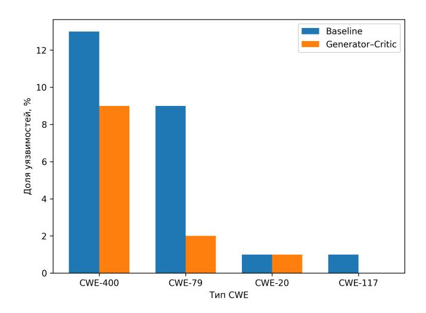

# Агентный подход к повышению безопасности кода, генерируемого большими языковыми моделями

Пискуровский Матвей Григорьевич [311502@niuitmo.ru]

Аннотация—В работе рассматривается задача повышения безопасности кода, генерируемого большими языковыми моделями. Несмотря на высокое качество генерации, современные модели склонны воспроизводить типовые программные уязвимости, в частности ошибки обработки пользовательского ввода и нарушения принципов безопасного программирования.

В статье предлагается агентный подход, основанный на предварительном анализе уязвимостей базовой генерации и последующем использовании полученной статистики для формирования целевых security-промптов. Дополнительно исследуется влияние мультиагентной архитектуры «генератор-критик» на снижение доли уязвимого кода. Экспериментальные результаты показывают, что предложенный метод позволяет существенно повысить безопасность генерации без дообучения модели и с контролируемым снижением функциональной корректности.

Index Terms—большие языковые модели, безопасность кода,  ${\rm CWE}$ , мультиагентные системы, prompt engineering

### I. Введение

Большие языковые модели (Large Language Models, LLM) широко применяются для автоматизации процесса разработки программного обеспечения, включая генерацию исходного кода, автоматическое исправление ошибок и рефакторинг. Высокие показатели функциональной корректности делают такие модели привлекательными для практического использования.

В то же время многочисленные исследования показывают, что LLM склонны воспроизводить типовые программные уязвимости, включая отсутствие валидации входных данных, небезопасную работу со строками и некорректное управление ресурсами. Подобные опибки описываются в классификации Common Weakness Enumeration (CWE) и представляют серьёзную угрозу при использовании сгенерированного кода в продуктивных системах.

Существующие подходы к повышению безопасности включают дообучение моделей на специализированных датасетах или постобработку результатов с помощью статического анализа. Однако данные методы требуют значительных вычислительных ресурсов либо не учитывают специфику процесса генерации.

В данной работе предлагается альтернативный подход, основанный на анализе распределения уязвимостей в базовой генерации и использовании полученных

данных для формирования целевых security-промптов. Дополнительно исследуется влияние мультиагентной архитектуры «генератор-критик», в которой процесс генерации и анализа кода разделён между несколькими агентами.

Научная новизна работы заключается в использовании статистики СWE-уязвимостей как источника информации для адаптивного промптирования LLM, а также в комплексной оценке влияния мультиагентной архитектуры на баланс между функциональной корректностью и безопасностью генерируемого кода.

# II. Постановка задачи

Целью исследования является снижение доли уязвимого кода, генерируемого большими языковыми моделями, при сохранении приемлемого уровня функциональной корректности.

Для достижения поставленной цели рассматриваются следующие подходы:

- базовая генерация без дополнительных механизмов контроля;
- генерация с использованием целевых securityпромптов;
- мультиагентная архитектура «генератор-критик»;
- комбинация мультиагентного подхода и адаптивного промптирования.

Оценка качества генерации проводится с использованием метрик pass@1, характеризующей вероятность получения функционально корректного решения, и  $\sec_p ass$ @1, , .

# III. Методология

На первом этапе выполняется генерация кода с использованием базового промпта без дополнительных ограничений. Полученные примеры анализируются с применением автоматических средств выявления уязвимостей, что позволяет определить распределение CWE-классов, характерных для рассматриваемой модели.

На основе выявленного распределения формируются целевые security-промпты, которые явно акцентируют внимание модели на предотвращении наиболее распространённых ошибок, таких как отсутствие проверки входных данных и использование небезопасных функций.

Дополнительно исследуется мультиагентная архитектура «генератор-критик». В рамках данного подхода первый агент отвечает за первичную генерацию кода, в то время как второй агент выполняет анализ результата с точки зрения безопасности и формирует рекомендации по исправлению потенциальных уязвимостей. Итеративное взаимодействие агентов позволяет снизить вероятность появления типовых ошибок без изменения параметров модели.

# IV. Экспериментальные результаты

Экспериментальное исследование проводилось на наборе задач, ориентированных на генерацию серверных АРІ и обработку пользовательского ввода.

На рисунке 1 представлено распределение наиболее распространённых СWE-уязвимостей для базовой генерации и архитектуры «генератор-критик».

Рис. 1. Распределение CWE-уязвимостей для базовой генерации и архитектуры «генератор–критик»

Анализ результатов показывает, что использование критика позволяет существенно снизить частоту возникновения уязвимостей, связанных с отсутствием валидации входных данных и небезопасной обработкой пользовательского ввода. Наиболее заметное снижение наблюдается для уязвимостей, характерных для вебприложений и АРІ-ориентированных систем.

Полученные результаты подтверждают, что предварительный анализ уязвимостей базовой генерации и последующее адаптивное промптирование являются эффективным инструментом повышения безопасности LLM-сгенерированного кода.

# V. Ограничения и обсуждение

Следует отметить, что эффективность предложенного подхода существенно зависит от репрезентативности

начального анализа уязвимостей. При изменении домена задач или языка программирования распределение CWE может отличаться, что потребует пересмотра используемых security-промптов.

Кроме того, мультиагентная архитектура увеличивает количество обращений к модели, что приводит к росту вычислительных затрат. Тем не менее, в сценариях, где безопасность является критически важной, данный компромисс может быть оправдан.

# VI. Заключение

В работе предложен агентный подход к повышению безопасности кода, генерируемого большими языковыми моделями. Подход основан на анализе уязвимостей базовой генерации и использовании адаптивного security-промптирования в сочетании с архитектурой «генератор-критик».

Экспериментальные результаты показывают, что предложенный метод позволяет существенно снизить долю уязвимого кода без дообучения модели и без изменения её параметров. Полученные выводы свидетельствуют о перспективности агентных и промптинженерных подходов для повышения безопасности автоматически генерируемого кода.