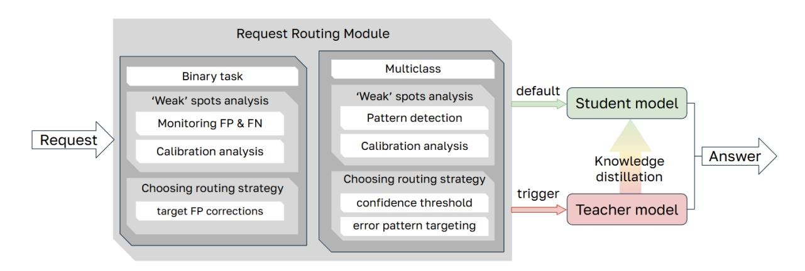
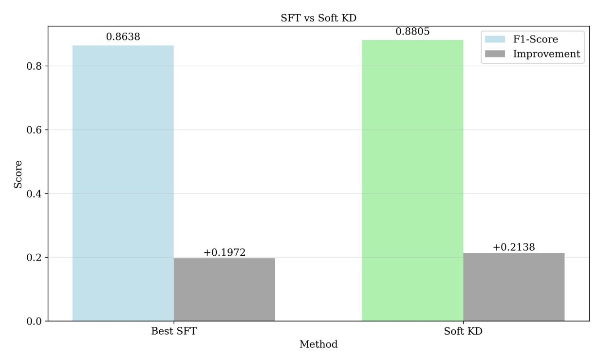
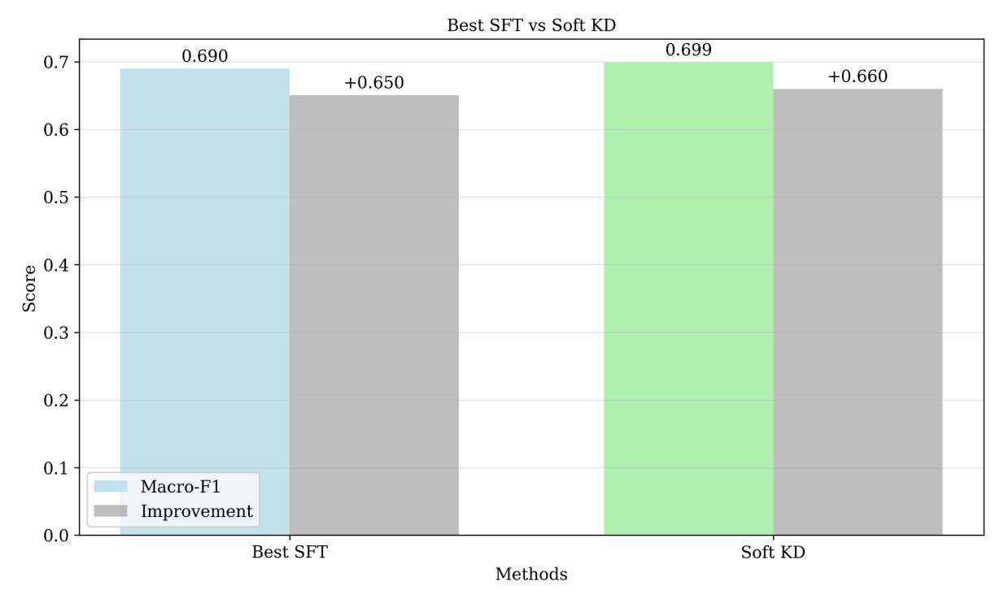
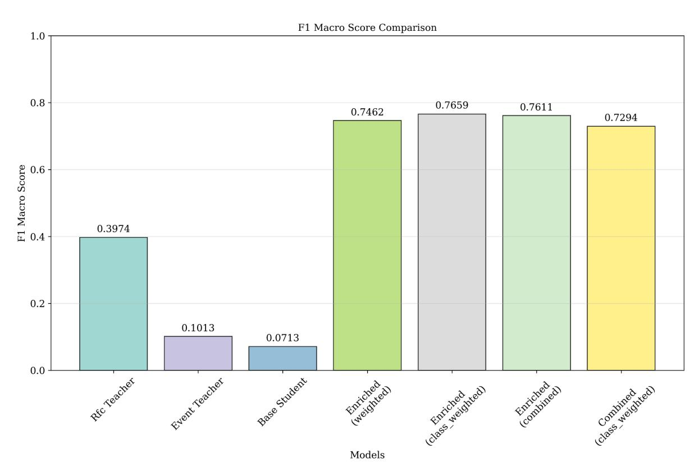
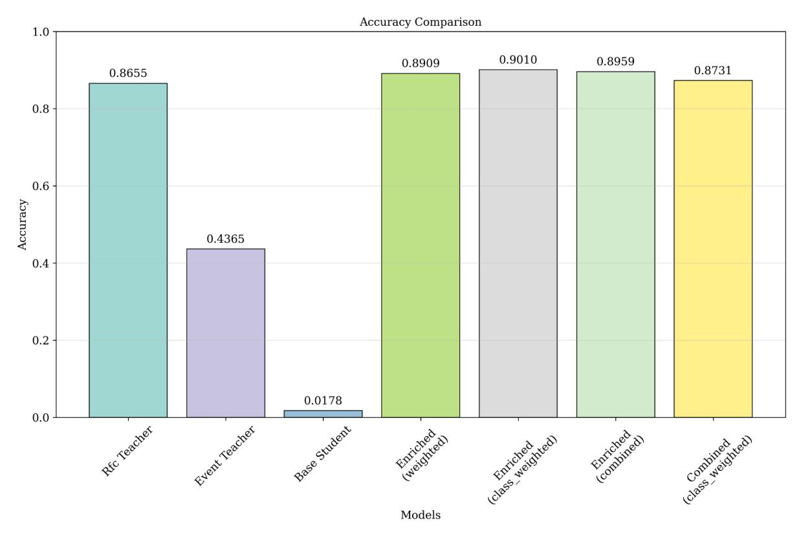
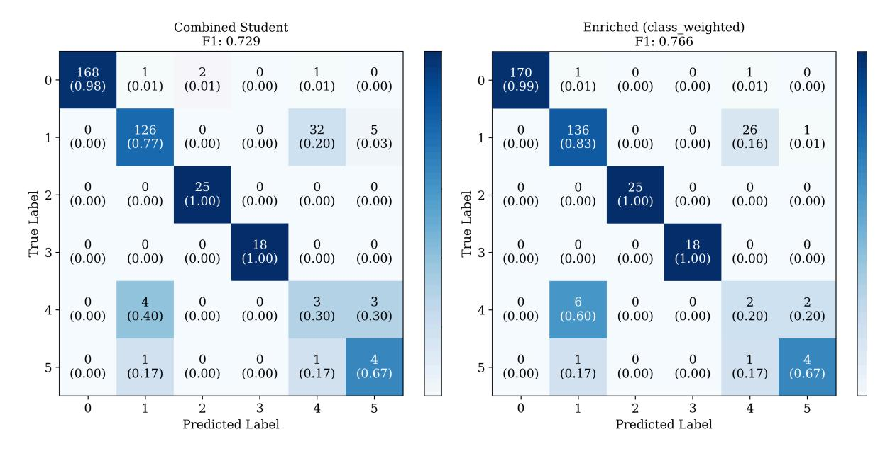
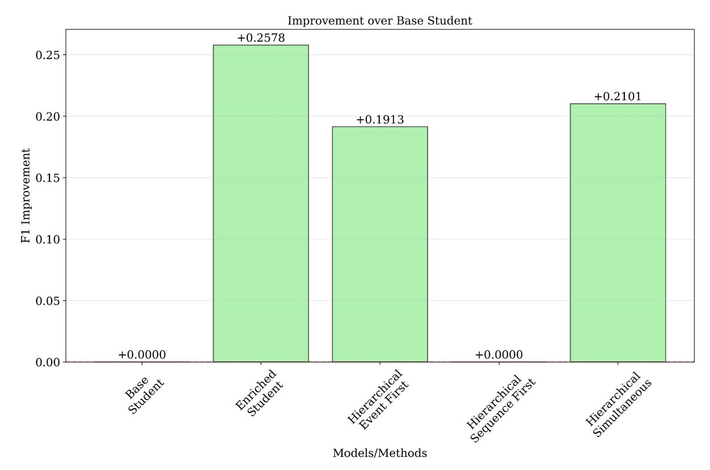
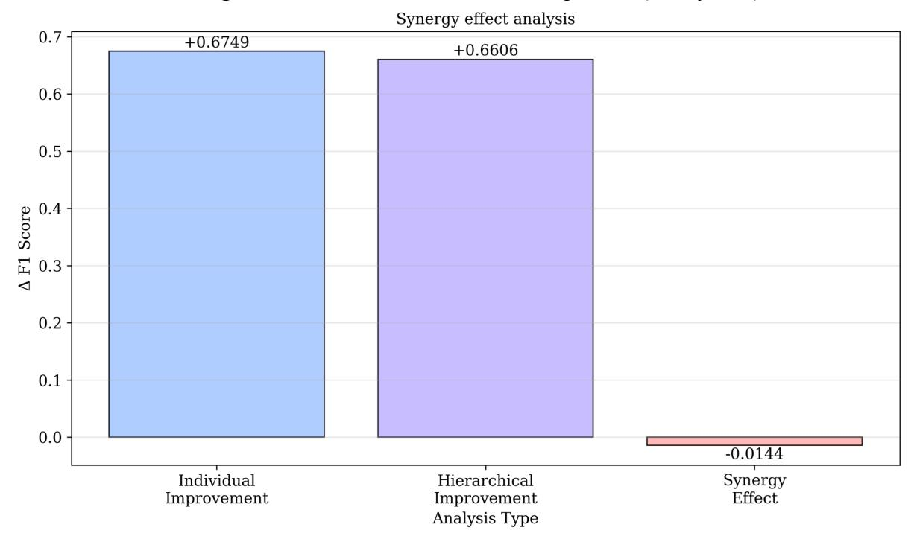

### **Post-Distillation Teacher Calling: Heuristics for Improving Student Predictions Anna Nikolaevna Kosmacheva, Maria Andreevna Khodorchenko**

#### **Abstract**

This study investigates a hybrid inference framework that combines knowledge distillation with dynamic query routing between a compact student model and a more accurate teacher model. While other works on knowledge distillation have largely focused on "how to compress" models, comparatively little attention has been paid to "when to rely on the compressed model" at inference time. The core innovation is a Request Routing Module of which consists of three stages. First, a teacher is trained on the full training set, while a student is trained on only 10% of the data using soft-label distillation. Second, the student's residual errors are analyzed offline on a separate validation set to characterize its "weak spots": for binary tasks, this analysis is based on false positive/negative rates and confidence calibration; for multiclass tasks, it uses confusion matrices, error gaps per class, and confidence distributions. Third, a family of routing strategies is simulated on the validation set and evaluated on an independent test set under constraints on teacher usage. Strategies include confidence-threshold routing, targeted correction of specific error patterns, routing for problematic classes, and selective correction of false positives.

Experiments on two distinct tasks: log-based anomaly detection (binary classification) and RFC document categorization (multiclass classification) — demonstrate the effectiveness of the approach. Soft knowledge distillation consistently outperforms supervised fine-tuning, producing students that are both more accurate and better aligned with teacher probabilities. The error analysis reveals stable, task-specific weaknesses that can be exploited by simple routing policies. In anomaly detection, a targeted false-positive correction strategy yields measurable accuracy gains with teacher involvement below 1%. In the multiclass setting, routing based on identified confusion patterns or confidence thresholds improves accuracy by up to several percentage points while using the teacher on a small fraction of queries. Additional experiments with combined and hierarchical distillation from event-level and sequence-level teachers show that a single well-designed enrichment-plus-distillation stage outperforms more elaborate hierarchical schemes. Overall, the results demonstrate that coupling knowledge distillation with explicitly optimized routing rules is a practical way to enhance accuracy–efficiency trade-offs in hybrid teacher–student systems.

#### **Keywords**

Knowledge distillation, weak-spot analysis, request routing module, Soft KD, Combined KD **Acknowledgments**

**УДК** 004.853

# **Обращение к учителю после дистилляции: Эвристики для улучшения предсказаний студента**

**Анна Николаевна Космачева, Мария Андреевна Ходорченко**

#### **Аннотация**

**Введение.** В работе рассматривается гибридная система логического вывода, в которой методы дистилляции знаний сочетаются с динамической маршрутизацией запросов между компактной моделью‑студентом и более точной моделью‑учителем. В отличие от большинства исследований по дистилляции, сосредоточенных на вопросе «как сжать модель», здесь акцент сделан на проблеме «когда можно полагаться на компактную модель» во время инференса, что и составляет научную новизну подхода. **Метод.** Предлагается модуль маршрутизации запросов, включающий три этапа. На первом этапе учитель обучается на полном обучающем наборе, а студент — только на 10% данных с использованием мягкой (soft‑label) дистилляции. На втором этапе проводится анализ остаточных ошибок студента на отдельной валидационной выборке для выявления его «слабых мест»: для бинарных задач анализируются доли ложноположительных и ложноотрицательных ответов и калибровка уверенности, для многоклассовых — матрицы ошибок, разрывы по ошибкам между классами и распределения уверенности. На третьем этапе на валидационной выборке моделируется семейство стратегий маршрутизации, которые затем оцениваются на независимом тестовом наборе при ограничении на долю обращений к учителю. Рассматриваются стратегии пороговой маршрутизации по уверенности, адресной коррекции типичных ошибок, маршрутизации для проблемных классов и выборочной коррекции ложноположительных ответов. **Основные результаты.** Эксперименты проводились на двух задачах: обнаружение аномалий по логам (бинарная классификация) и категоризация документов RFC (многоклассовая классификация). Показано, что мягкая дистилляция знаний стабильно превосходит классическую тонкую настройку (SFT), формируя студентов с более высокой точностью и лучшим совпадением с вероятностными оценками учителя. Анализ ошибок выявил устойчивые, зависящие от задачи слабости студента, которые можно эффективно использовать при построении правил маршрутизации. В задаче аномалий целевая коррекция ложноположительных предсказаний дала заметный прирост точности при доле запросов к учителю менее 1%. В многоклассовой задаче стратегии,

основанные на выявленных паттернах путаницы и порогах уверенности, обеспечили прибавку точности на несколько процентных пунктов при использовании учителя лишь для небольшой части запросов. Дополнительные эксперименты с комбинированной и иерархической дистилляцией от учителей на уровне событий и последовательностей показали, что одна хорошо спроектированная стадия обогащения с последующей дистилляцией превосходит более сложные иерархические схемы. **Обсуждение.** По сравнению с существующими методами дистилляции, ориентированными на улучшение самого студента, предложенный подход формализует и оптимизирует решение о том, когда следует обращаться к учителю. Результаты показывают, что сочетание дистилляции знаний с правилами маршрутизации позволяет существенно улучшить баланс между точностью и затратами вычислений в гибридных системах «учитель–студент», что делает данный подход перспективным для приложений с ограничениями по ресурсам и требованиям к точности.

#### **Ключевые слова**

Дистилляция знаний, анализ слабых мест студента, модуль маршрутизации запросов, дистилляция «мягкими» метками, комбинированная дистилляция

#### **Благодарности**

## **Introduction**

Modern machine learning models now achieve remarkable performance, but their computational and memory demands make them costly to deploy at scale. Current knowledge distillation (KD) approaches can significantly reduce the parameters while preserving most of the model's work results.

Knowledge distillation (KD), in which a large teacher model transfers its predictive behavior or internal representations to a smaller student, is a standard approach to reduce these costs while preserving most of the original performance. Combined with cascaded classifiers, deferral mechanisms, and selective prediction strategies, KD enables architectures in which different models are invoked adaptively depending on input difficulty and desired accuracy–efficiency trade‑offs.

However, in complex scenarios, a student can make mistakes as not all knowledge can be equally well transferred. Therefore, the question that is addressed in current research is: how can knowledge-based models be effectively implemented by analyzing student error patterns after distillation and intelligently directing problematic queries to the teacher, while maintaining the student's speed for other queries?

Experiments show that even after distillation, students still have typified weaknesses. There are no deeply studied and formalized methods for building a hybrid decision-making system that analyzes and identifies the student model's output as "weak spots" in real time, redirects such requests to be processed by the teacher model to ensure maximum accuracy, while using the fast student model to process all other requests.

# **Related work**

Recent research on efficient inference and model compression has converged on a common pattern: combining knowledge distillation with cascaded or selectively routed computation in order to balance accuracy and resource usage. Across multiple domains and architectures, these works progressively move away from monolithic student–teacher training towards schemes in which what is distilled, where it is distilled, and when the student refers to a stronger model are all treated as design variables.

Several contributions integrate knowledge distillation with cascaded or dynamic-depth architectures, thereby coupling the training objective with routing behavior at inference time. CKDF [1] proposes a three-stage Cascaded Knowledge Distillation Framework for class-incremental learning, in which an intermediate Feature Calibration Network (FCN) is first trained to recalibrate the old model's representations before the new model is distilled from this calibrated teacher and then used to update exemplars. By separating calibration from new-task learning, CKDF mitigates the conflict between distillation and classification losses, illustrating how intermediate stages can realign teacher and student representations so

that subsequent routing is more stable. ERDE [2] similarly combines distillation with early-exit networks, training a student early-exit model from a more complex teacher while adding an entropy-regularization term at intermediate exits to enforce uncertainty on samples where the teacher is wrong or uncertain. This co-design of exit-conditioned distillation and confidence-based early termination demonstrates that routing decisions can be made reliable only if the distillation objective explicitly differentiates between easy and hard instances at different depths. SelfXit [3] treats early exits as self-distilled surrogates of a fixed backbone: exit heads are trained on unlabeled inference data to reproduce the backbone's output distribution via KL divergence, then calibrated and thresholded to decide when to terminate inference. In contrast to ERDE's supervised setting, SelfXit shows that routing points can be learned from the behavior of a deployed model, suggesting unsupervised pathways for constructing dynamic query routing mechanisms that sit between a powerful teacher and more simple students.

A set of works focuses not on architectural cascades but on how and where knowledge is transferred between teacher and student, often with an eye toward selective or partial distillation. AdaSPEC [4] addresses speculative decoding by observing that conventional KL-based distillation over all tokens is misaligned with the objective of maximizing the acceptance rate of draft tokens by the target model. Therefore it wastes the draft model's limited capacity on hard tokens that are unlikely to be accepted. AdaSPEC introduces a two-phase procedure in which a reference model distilled from the target is used to classify tokens as "easy" or "hard," and only easy tokens are retained for training the draft model, leading to significantly higher acceptance rates without loss of generation quality. SelKD [5] generalizes the idea of partial transfer from tokens to classes by reinterpreting knowledge distillation through the lens of inverse optimal transport, in which the student learns couplings between inputs and label features that need only cover a specified subset of the teacher's label space. Within this framework, closed-set SelKD trains a student on a designated subtask, while open-set SelKD relaxes softmax constraints so that the student can explicitly output "not selected" for out-of-scope inputs, thereby formalizing selective recognition and rejection as part of the distillation objective. Both works effectively introduce selection operators over the distillation signal that implicitly define routing policies about where the student should mimic the teacher and where it should abstain, a principle that can be lifted to routing entire queries between models.

At the feature level, recent distillation methods sharpen our understanding of which aspects of a teacher's representation should be transferred, and how this transfer can itself be made dynamic. In the work [6] the authors revisit raw feature distillation in semantic segmentation and show that naive mean squared error over feature maps is highly sensitive to hyper parameters because the magnitude and angular components of the error are entangled. By decomposing the loss and proposing angular distillation variants that align feature directions while normalizing magnitudes, they obtain state-of-the-art performance across segmentation and detection benchmarks with significantly improved robustness. This disentangling of geometric aspects of teacher–student alignment suggests additional axes along which routing decisions could be conditioned. The DPK [7] framework injects teacher features as dynamic prior knowledge into the student: hybrid feature maps are formed by masking and stitching student and teacher activations, processed through an encoder–decoder, and trained with a reconstruction loss whose masking ratio is adaptively set using a CKA-based similarity measure. In doing so, DPK turns the strength and location of teacher influence into a state-dependent quantity that evolves as the student learns, thereby reducing performance degradation when teacher–student capacity gaps are large.

The following stage of work engages directly with the problem of routing and deferral between models, providing theoretical and algorithmic foundations for designing

routing-aware distillation systems. The Gatekeeper framework [8] explicitly targets model cascades, introducing a general-purpose loss that calibrates a small front model to output high confidence on instances it can classify correctly and low confidence on instances it would misclassify. By optimizing this loss, the small model's confidence better reflects its true competence, improving the trade-off between joint accuracy and deferral ratio when a simple confidence threshold is used to decide whether to route queries to a larger back-end model. The authors of the work [9] formalize the underlying decision problem by deriving Bayes-optimal deferral rules for two-model cascades and showing that naive confidence-based rules can be provably suboptimal in realistic settings involving specialist downstream models, label noise, or distribution shift. They propose learned deferral mechanisms that use joint prediction patterns from both models to approximate the oracle rule, achieving superior accuracy–compute trade-offs in these challenging regimes. Together, Gatekeeper and this analysis indicate that routing should be treated as a first-class learning objective: distillation alone cannot guarantee good routing behavior, and specialized losses or auxiliary models are needed to align a student's confidence and error profile with the needs of a cascade.

Several works examine cascaded training and multistage transfer from a more abstract perspective, reinforcing the view that sequential, decomposed learning processes can yield better generalization and robustness than single-stage training. CasCoD [10] studies chain-of-thought distillation for reasoning tasks and demonstrates decomposing standard single-step learning into a two-stage cascade: first teaching the student to generate rationales given questions, then to produce answers conditioned on question–rationale pairs. Although CasCoD operates within a single model, its training and inference pipeline mimics a routing scheme between "rationale-generation" and "answer-prediction" modules, underscoring that structuring computation into staged subtasks can itself be a powerful regularizer. The multistage transfer learning survey in the medical sphere [11] advocates for three-stage pipelines in which models are successively adapted from large generic datasets to intermediate domains and finally to target tasks, with each stage reusing and refining the previous one's weights. These works show that multi-stage transfers can improve performance and data efficiency, especially when domain gaps are large.

LLM‑oriented knowledge distillation research primarily focuses on compression quality, training signals, and supervision formats, rather than routing per se, but it provides important context for how student–teacher relationships are modeled. The authors of [12] present survey KD methods for LLMs and categorize white‑box approaches that exploit internal representations versus black‑box methods that only rely on input–output behavior, highlighting persistent challenges in robustness, bias transfer, and deployment‑time adaptability despite substantial progress in compression techniques. In the article [13], the authors trace KD's evolution from a model compression tool to a unifying framework that encompasses logit‑based, feature‑based, and multi‑teacher methods, while emphasizing limitations such as architectural heterogeneity, teacher bias, and the difficulty of supporting lifelong or continual learning in practice. Building on these foundations, in [14], an evolutionary distillation method was proposed, in which an LLM acts as a black‑box teacher that iteratively diagnoses a student's weaknesses and generates targeted synthetic data, thereby explicitly closing the loop between error analysis and data generation. The article [15] extends KD to preference learning by introducing direct preference knowledge distillation, where the teacher's preferences are distilled into the student via an implicit reward signal derived from gradient analysis, connecting KD to reinforcement‑learning‑style value functions and suggesting that teacher–student discrepancies can be interpreted as preference violations.

Other works explore supervision structure and training curricula for LLM students. The step by-step distillation of knowledge from large, logical LLM systems is a process of transferring the structure of intermediate tasks, not just the final labels, and is considered in [16]. The method formulated as a multitask sequence-prediction problem, can enable smaller models to match or surpass larger teachers while using less data, underscoring the importance of intermediate reasoning supervision over pure label matching. The work [17] demonstrates that carefully designed post-training, combining model-based data selection, curriculum design, and tailored KD schemes, allows small language models to approach the performance of much larger systems at a fraction of the cost. Finally, the authors of [18] introduced MiniLLM, a white-box distillation framework that replaces the standard forward KL objective with a reverse-KL formulation and policy-gradient-style training, showing that students trained on their own sampled trajectories and corrected by a teacher can reduce exposure bias and improve calibration while remaining an order of magnitude smaller.

These lines of work indicate that knowledge distillation has been extensively explored as a means to compress models and shape student behavior, and that cascades, early exits, and selective prediction provide powerful tools for structuring computation across models and stages. At the same time, even in LLM-oriented studies that explicitly analyze student weaknesses, preference signals, and training curricula, the main question remains implicit: how and when should a system decide to rely on a distilled student versus invoking a stronger model at inference time. Existing approaches mostly treat routing as a fixed heuristic (confidence thresholding or predefined cascades), rather than as a mechanism that exploits the error structure of the distilled student. This leaves a gap for methods that explicitly integrate KD with dynamic query routing, using the information about student uncertainty and failure modes to adaptively select the knowledge source, , which defines the scientific novelty of the present research.

#### **Proposed Request Routing Method**

The core of our methodology is a hybrid inference system that dynamically routes queries between a compact student model and a powerful teacher model. The system's operation is governed by the Request Routing Module, as depicted in Figure 1.

Figure 1. Scheme of suggested solution

The proposed routing methodology is based on the error analysis of the distilled student model and includes three stages. At the first stage, models are trained: the teacher  $(f_{\tau})$  learns

from the full data set  $D_{train} = \{(x_i, y_i)\}$   $\sum_{i=1}^{N_{train}}$  and the student  $(f_S)$  learns from a limited

subset  $D'_{train} \subset D_{train}$  which is 10% of the initial volume using distillation methods. The second stage includes an offline analysis of the student's errors based on a dedicated validation sample  $D_{val} = \{(x_i, y_i)\}_{i=1}^{N_{val}}$  that was not used during his training. At this stage,

the student's systematic weaknesses are identified and routing strategies are developed based on them. At the third stage, the system is simulated and the effectiveness of the selected strategies is evaluated on an independent test sample  $D_{test} = \{(x_i, y_i)\}_{i=1}^{N_{test}}$ .

The analysis is aimed at identifying systematic errors of the student in comparison with the teacher. Depending on the type of task, different approaches are used. For a binary problem, where  $y \in \{0, 1\}$ , the key metrics are the False Positive Rate (FPR) and False Negative Rate (FNR) of student responses, calculated on a window of the last W examples. Additionally, the calibration of the student's confidence is analyzed. For binary probability  $p_s \in [0, 1]$ , absolute certainty is determined:

$$conf_{S} = 2 \cdot |p_{S}(x) - 0.5|.$$

The average values of confidence based on correct and erroneous examples serve as an indicator of how much a student's confidence correlates with the correctness of his predictions.

For a multi-class problem with C > 2 classes, a matrix of validation data errors  $M \in \mathbb{N}^{(C \times C)}$  is constructed and analyzed. Systematic patterns of confusion are revealed — pairs of classes for which the normalized error rate exceeds the threshold:

$$\frac{M_{ij}}{C} > \alpha, i \neq j.$$

$$\sum_{k=1}^{K} M_{ik}$$

Class c is considered problematic if the student's error on it significantly exceeds the teacher's error:

$$ErrorRate_{c}^{S} > ErrorRate_{c}^{T} + \beta$$
, where  $\beta$  is the specified gap.

For the confidence analysis, the maximum probability assigned by the student to the predicted class is used:  $conf_s = max_c(p_s^c(x))$ .

Based on the analysis, a set of strategies is proposed for conditionally redirecting a request from a student to a teacher. The strategy's application is simulated on a validation sample to assess its potential effectiveness.

#### Binary classification strategies:

- 1. The Confidence Threshold strategy: the request is routed to the teacher if the student's confidence is below the specified threshold  $(conf_s(x) < \tau_{conf})$ .
- 2. False Positive Prevention Strategy: When a student predicts a positive grade with insufficient confidence.
- 3. The strategy for the targeted correction of false positives: routing occurs for requests that, by their characteristics are similar to the historical false-positive student responses identified on  $D_{val}$

## Multiclass classification strategies:

1. The strategy for targeted correction of error patterns: routing is applied if the student's prediction falls into the identified frequent pattern of confusion. In practice, the true class is unknown during the inference, so the strategy adapts if the student predicts the class j, and

input x is semantically close to the examples of class i from the pattern (i,j), the request is transmitted to the teacher.

- 2. Confidence threshold strategy based on erroneous examples. The confidence threshold is set based on the percentile of the student's confidence distribution based on his own mistakes in  $D_{val}$ . For a given percentile p, a threshold is calculated, if confidence is below the specified threshold, routing is triggered.
- 3. A routing strategy for problem classes: all queries for which the student predicts a class from a set of problematic ones are automatically sent to the teacher.

To select the best strategy  $s^*$ , each candidate strategy s is evaluated on a validation sample  $D_{val}$  through simulation. For each strategy, the following are calculated:

- The expected accuracy Acc(s) is the proportion of correct answers in a hybrid system where the teacher according to the strategy condition processes the request, otherwise the student.
  - Teacher usage rate r(s) is the percentage of requests redirected to the teacher.
- The average inference time  $\overline{t}(s) = (1 r(s)) \cdot t_S + r(s) \cdot (t_S + t_T)$ , where  $t_S$ ,  $t_T$  is the inference time of the student and teacher in one example.
- Increased accuracy  $\Delta Acc(s) = Acc(s) Acc_{S}$ , where  $Acc_{S}$  is the accuracy of the student alone.

The optimal strategy is selected from a variety of strategies that satisfy the teacher's usage restriction  $r(s) \le r_{max}$ ,  $(r_{max} = 0.3 \ by \ default)$  by maximizing the composite efficiency criterion:

$$s^* = arg \max[\Delta Acc(s) + \lambda \cdot \frac{t_T}{\bar{t}(s)}],$$

where the coefficient  $\lambda$  regulates the balance between an increase in accuracy and a gain in speed relative to using only the teacher.

The input and output for each of the tasks are briefly presented in Table 1.

*Table 1.* Input and output of the routing module Binary task Multiclass task  $f_{T}$ ,  $f_{S}$  — trained teacher and student  $f_T$ ,  $f_S$  — trained teacher and student models: models:  $D_{val}$  — validation sample  $\{(x_i, y_i)\};$  $D_{val}$  — validation sample  $\{(x_i, y_i)\}$ ; W — the size of the window for analysis; C — number of classes:  $r_{max}$  — the maximum allowable percentage  $\alpha$  — the threshold for detecting patterns of confusion; of teacher usage. maximum allowable  $r_{max}$ the Output: The recommended strategy is s\* with percentage of teacher usage. parameters; Output: Expected performance (accuracy, time, The recommended strategy is s\* with percentage of teacher usage). parameters: Expected performance (accuracy, time, percentage of teacher usage).

### **Experimental design and analysis**

Before validating the routing algorithm, we conducted a series of experiments that tested the hypotheses set before us:

- 1. Is the soft prediction distillation approach more effective than SFT?
- 2. Does joint distillation from two types of teachers event-level and sequence-level help improve the quality of the student model?
- 3. Does the hierarchical approach in distillation improve the quality of the student model?

The experiments focused on three key aspects: the quality of knowledge distillation, the characterization of student weaknesses, and the performance of routing strategies. The experiments were conducted on two different tasks: anomaly detection (binary classification) and RFC document categorization (multiclass classification).

To ensure representativeness and prevent data leakage, each set was divided into three disjoint subsets:

- The HDFS dataset1 for the anomaly detection task consisted of log sequences labeled normal and abnormal. We used 60% for training, 20% for validation, and 20% for testing.
- The dataset of RFC documents2 for multiclass classification contained technical texts with standards and specifications assigned to one of 53 categories. The separation was 70% for training, 15% for validation, and 15% for testing.

For experiments with distillation and routing: the teacher was trained on 100% of the training data, while the student model was trained on 10% of randomly selected examples from the training set. The validation set was used exclusively for analyzing student errors and choosing a routing strategy, and the final assessment was carried out on a test set that did not participate in any of the previous stages.

The CountVectorTeacher model based on a bag of words with subsequent K-Means clustering (n\_clusters=10) and logistic regression was chosen as the teacher model for binary classification. For multiclass classification, the teacher model was RFCTeacher, a random forest with 100 trees trained on TF-IDF representations of texts. The student models were lightweight N-gram models with an n-gram size of n=3.

The first group of experiments was aimed at comparing distillation methods. We evaluated the quality of F1-score (binary) and macro-F1 (multiclass) distillation on a test set; the mean square error (MSE) between the probability distributions of the teacher and the student; teacher-student agreement.

The hypothesis was that Soft KD, by transferring the teacher's softened output distribution, would yield a student model with superior accuracy and better calibration compared to SFT. The results confirmed this hypothesis. For anomaly detection, Soft KD achieved an F1-score of 0,8805, outperforming the best SFT method by 1,67% (Figure 2).

2 RFC Editor, "tar – The Tape Archive Format" (RFC collection page), available at: https://www.rfc-editor.org/rfc/tar/

1 AIT Anomaly Detection Log Datasets, available at: https://github.com/ait-aecid/anomaly-detection-log-datasets

*Figure 2.* Comparison of SFT and Soft KD methods – binary classification

In the multiclass RFC task, Soft KD reached a macro-F1 of 0,6987, a marginal but consistent improvement over SFT, while matching the teacher's accuracy of 79,5% (Figure 3). This establishes Soft KD as our preferred distillation method.

*Figure 3.* Comparison of SFT and Soft KD methods – multiclass classification

A deeper investigation into the Soft KD process provided critical insights for the dynamic routing mechanism. We compared the initial student before the distillation (baseline)

with the distilled models and obtained the following results: the student's F1-score improving by +0,1990 on the binary task and its macro-F1 increasing by +0,6481 on the multiclass task. More importantly, the student's output became significantly better calibrated to the teacher's probabilistic judgments. For the binary task, the MSE between their outputs dropped precipitously from 0,711 to 0,033. For the multiclass task, the student's prediction agreement with the teacher surged from 4,2% to 67,6% (Table 2).

*Table 2.* Key results of experiment 1

| Task       | Model      | F1-score/ macro-F1 | Improvement | MSE to teacher | Consistency |
|------------|------------|-----------------------|-------------|----------------------|-------------|
| Binary     | Baseline   | 0,6667                | -           | 0,711                | 21,1%       |
|            | SFT        | 0,8638                | +0,1972     | 0,047                | 78,9%       |
|            | Soft KD | 0,8805                | +0,2138     | 0,033                | 88,1%       |
| Multiclass | Baseline   | 0,0391                | -           | 0,061                | 4,2%        |
|            | SFT        | 0,6895                | +0,6504     | 0,046                | 57,5%       |
|            | Soft KD | 0,6987                | +0,6596     | 0,058                | 67,6%       |

The subsequent error analysis revealed the structured, task-specific patterns that form the blueprint for dynamic switching (Table 3). In the multiclass task, the teacher demonstrated a high correction rate (71,7%) for specific, identifiable student error patterns, such as confusing class 1 for class 4. This pattern suggests an error\_pattern\_targeting routing strategy, where the teacher is invoked only for these high-risk confusions, boosting accuracy by 8,3% while engaging the teacher for just 6,6% of inferences. Conversely, in the binary anomaly detection task, the distilled student's primary residual error type was false negatives, but the teacher proved perfectly capable of correcting the student's rare false positives. This supports a target\_fp\_correction strategy, where the teacher selectively overrides only the student's false positive predictions, thereby optimizing accuracy with a negligible teacher usage rate of 0,8%.

*Table 3.* Evaluating the effectiveness of using a routing strategy

|                                            | SoftKD student — multiclass task | SoftKD student — binary task |
|--------------------------------------------|----------------------------------------------|------------------------------------------|
| Accuracy                                   | 0,795                                        | 0,799                                    |
| Student error rate                   | 20,5%                                        | 39,2%                                    |
| Teacher correction rate              | 71,7%                                        | 28,4%                                    |
| Expected accuracy (after routing) | 0,861                                        | 0,806                                    |
| Accuracy gain                           | 8,3%                                         | 0,8%                                     |

| Teacher usage    | 6,6%                                              | 0,8%                                               |  |
|---------------------|---------------------------------------------------|----------------------------------------------------|--|
| Routing strategy | Targeted correction of error patterns | Targeted correction of false positives |  |

Building upon the foundational comparison of distillation methods, the second experiment investigated a critical practical dimension: the relationship between the volume of data used to train the teacher model and the subsequent efficacy of the knowledge distillation process. The central hypothesis was that the quality of the transferred knowledge, and thus the performance of the distilled student, is intrinsically linked to the strength and generalization capability of the teacher, which is itself a function of its training data. We posited that while a teacher trained on more data would generally be stronger, the marginal benefit of distillation might follow a non-linear pattern, potentially revealing an optimal point for resource-efficient distillation.

As the teacher's data volume and its own performance increase, the absolute performance of the distilled student generally improves, but the margin of gain attributable solely to distillation evolves differently per task. For the binary task, distillation improvement steadily grew with more teacher data. However, for the more complex multiclass task, the most significant jumps in distilled student performance occurred at the lower data ratios (1%, 5%, 10%), with gains plateauing as the teacher consumed more data. This suggests that once the teacher has absorbed a sufficient but not exhaustive amount of data (approximately 10% in this case), the essential "knowledge signal" for the student becomes saturated. Additional teacher training data yields diminishing returns for the distillation process itself, though the final distilled student's performance continues to benefit from the teacher's higher baseline accuracy. Furthermore, the distilled student consistently and significantly outperformed the student model before distillation across all data ratios, underscoring the inherent value of knowledge transfer regardless of the teacher's strength.

The third experiment was devoted to the combined distillation of knowledge. This experiment went beyond working with a single teacher to find out whether the synergistic interaction of complementary teachers - in particular, a traditional teacher at the sequence level and a teacher at the individual event level — could lead to the creation of a better learning model. The main hypothesis was that an event-level teacher who models the statistical properties of individual components learns a more fundamental form of knowledge compared to a sequential-level teacher who studies holistic patterns.

For the binary anomaly detection task, the sequence teacher was a cluster-based counter model, while the event teacher was a statistical model analyzing the frequency and weight of individual log events. For the multiclass task, the sequence teacher was a logistic regression model for document vectors, and the event teacher operated on word-level distributions across classes. The student, who was again trained on the minimum data set (10%), was first "enriched" by pre-training with statistical data at the event level using methods such as weighting or combined weighting of features. This enriched student was then selected by one or both teachers. We compared several configurations: distillation from one sequence teacher to an enriched student, and combined distillation, in which the student loss function included soft targets from both teachers simultaneously.

The results presented in detail in Table 4, Figure 4.1 and Figure 4.2 support the combined approach. A student with a simple basic level performed poorly, F1-score = 0,6667 (binary) and macro-F1 = 0,0713 (multiclass).

*Table 4.* Key results of experiment 3 (Binary task)

| Model                     | F1-score | FP / FN   | Primary Knowledge Source            |
|---------------------------|----------|-----------------|-------------------------------------------|
| Sequence teacher       | 0,7504   | 0 / 799   | Holistic sequence patterns          |
| Event teacher          | 0,6667   | 2000 / 0  | Granular event statistics           |
| Baseline student       | 0,6667   | 2000 / 0  | Limited labeled data                |
| Enriched (weighted)+KD | 0,9245   | 145 / 148 | Events + Sequence Logits         |
| Enriched (combined)+KD | 0,9267   | 130 / 231 | Fused Event & Sequence Logits |

*Figure 4.1.* Multiclass macro-F1 comparison.

*Figure 4.2.* Multiclass accuracy comparison.

For the RFC multi-class assignment, the results once again confirmed the correctness of the approach. All the students who completed the enrichment and selection significantly exceeded the teachers and the basic level. The best model (enriched with the class\_weighted method and selected from RFC teacher) received a macro-F1 equal to 0,7659 and an accuracy of 0,9010, compared with the macro-F1 obtained from RFC teacher equal to 0,3974. Figure 5 represents the confusion matrices of the combined model and enriched one. It is noticeable that the method of simultaneous distillation from two teachers is similar to the method when a student first enriches himself at the expense of one teacher, and then distills knowledge from another. However, the second method gives better results, which indicates different tasks for event-teacher and sequence-teacher.

*Figure 5.* Multiclass confusion matrix.

The routing analysis based on this experiment suggests that there are nuances in the strategies. For a binary task, the teacher's almost perfect correction of the student's residual false positives allows using the target\_fp\_correction strategy with minimal cost. For the multiclass task, a higher level of disagreement (22,6%) and a more balanced correction potential between teacher and student indicate that a confidence\_threshold routing strategy would be more appropriate.

The fourth experiment was designed to study the hierarchical distillation of knowledge. Based on the success of the combined approach obtained during Experiment 3, this study aimed to determine whether a step-by-step distillation process, in which knowledge from different teachers is transferred in a certain order, could bring synergistic benefits beyond simple simultaneous combination. The hypothesis was that a carefully organized hierarchy, for example, first introducing basic knowledge at the event level, and then refining it using high-level sequence patterns, could lead to a better internal representation in the student model, potentially surpassing the effectiveness of the one-step combined method.

The experimental structure maintained consistency with previous settings, using the same classification of RFC documents and anomaly detection tasks in the HDFS log. The teachers (at the sequence level and at the event level) and the students of the basic group were trained as before. The essence of this experiment was to test three different hierarchical distillation strategies: 1) event\_first, when the student first undergoes distillation from the teacher of events, and then from the teacher of the sequence; 2) sequence\_first, in reverse order; and 3) simultaneous, which served as a hierarchical analogue of the previous combined method, optimizing the joint losses of both teachers, but within the same hierarchical learning cycle. They were compared with the previously established strict baseline of the enriched student from Experiment 3, who was pre-enriched with event data and then received from the sequence teacher.

The results summarized in Table 5 allowed us to draw a clear conclusion: the hierarchical approach did not have a significant synergistic effect compared to the simpler single-stage combined distillation from experiment 3. For the multiclass task, the best hierarchical method (simultaneous) gave a macro-F1 equal to 0,7319, which was actually slightly lower (-0,0144) than the performance of the improved student (0,7462). Similarly, for

the binary assignment, the best hierarchical F1-score (simultaneous = 0,8768) fell short of the 0,9245 score obtained by students with improved academic performance. The synergetic analysis quantified this by showing a negative synergistic effect for both tasks, indicating that the complex hierarchical procedure did not bring additional benefits.

*Table 5.* Key results of experiment 4

|            | Model                     | F1-score / macro-F1 | Key findings            |
|------------|---------------------------|---------------------------|----------------------------|
| Binary     | Enriched (combined)+KD | 0,9245                    | Reference baseline      |
|            | Hierarchical              | 0,8768                    | -0,0477 (No synergy) |
| Multiclass | Enriched (combined)+KD | 0,7462                    | Reference baseline      |
|            | Hierarchical              | 0,7319                    | -0,0144 (No Synergy) |

The sequence\_first strategy performed particularly poorly, especially in the binary assignment, where it showed no improvement over the baseline test (Figure 6.1 and 6.2). This suggests that the initial transfer of high-level knowledge about the sequence of actions to a naive student creates an idea that is subsequently difficult to reconcile with low-level event statistics. Conversely, the event\_first approach was more effective, implying that establishing a fundamental understanding at the function level is a better prerequisite for making complex decisions at the sequence level. However, even such an optimal hierarchical arrangement could not be compared in efficiency with the single-stage process of "enrichment and then distillation" from experiment 3, where information about events was obtained by weighing the signs before the distillation process began, rather than at a separate stage of distillation.

*Figure 6.1.* Hierarchical methods comparison (binary task).

*Figure 6.2.* Hierarchical methods comparison (multiclass task).

In conclusion, although the involvement of additional teachers is very useful, the results show that a complex hierarchical organization of the distillation process does not necessarily lead to better results than a well-thought-out single-stage combined approach. The most effective method remains the one that was tested in Experiment 3: preprocessing the student's

model with information at the event level (enrichment) followed by direct transmission from the teacher at the level of the initial sequence.

# **Results**

The experimental investigation yielded substantial evidence supporting the efficacy of the proposed hybrid knowledge distillation system. The initial hypothesis regarding the superiority of Soft Knowledge Distillation (Soft KD) was unequivocally confirmed. Across both binary anomaly detection and multiclass RFC document classification, Soft KD consistently produced a student model that surpassed the performance of all Supervised Fine-Tuning (SFT) variants. Specifically, for binary classification, Soft KD achieved an F1-score of 0,8805, representing a 1,67% improvement over the best SFT method. In the multiclass setting, it attained a macro-F1 of 0,6987, not only outperforming SFT but also matching the teacher model's accuracy of 79,5% while maintaining a nearly identical inference speed. This result establishes Soft KD as the optimal foundational technique for model compression within the proposed framework.

A pivotal contribution of this work stems from the detailed analysis of student "weak spots" post-distillation. The investigation revealed that error profiles are profoundly task-dependent, which directly informed the design of adaptive routing strategies. For binary anomaly detection, the distilled student's primary weakness was a high false-negative rate (78,3%). Conversely, in multiclass RFC classification, the most significant errors were systematic confusions between specific classes (class 1 and class 4), which were, however, 100% correctable by the teacher model. This dichotomy necessitated and validated the development of distinct, task-aware routing logic within the hybrid system.

Consequently, several dynamic routing strategies were developed and tested. For the binary task, a target\_fp\_correction strategy was implemented, selectively invoking the teacher only to rectify false positives, which yielded a 0,80% accuracy gain with minimal computational overhead (0,8% teacher usage). For the multiclass task, an error\_pattern\_targeting strategy was designed to route queries exhibiting the specific confusion pattern to the teacher, resulting in a potential 6,56% accuracy improvement. Furthermore, a confidence\_threshold strategy, applicable to scenarios with broader uncertainty, demonstrated a potential 15,74% accuracy gain. These strategies collectively demonstrate the system's capability to intelligently arbitrate between efficiency and accuracy.

## **Conclusion**

The experimental investigation yielded substantial evidence supporting the efficacy of the proposed hybrid knowledge distillation and routing system. First, the hypothesis regarding the superiority of Soft Knowledge Distillation over Supervised Fine-Tuning was consistently confirmed across both binary anomaly detection and multiclass RFC classification: Soft KD yielded students that were not only more accurate but also significantly better calibrated with respect to the teacher's probabilistic outputs. This established Soft KD as a robust foundation for constructing compact students that are suitable candidates for subsequent routing and hybrid inference. Second, the systematic analysis of post‑distillation error profiles revealed stable, task‑specific "weak spots" of the student: in the binary setting, residual false negatives dominated, whereas in the multiclass setting, errors were concentrated in a small number of recurring confusion patterns between specific classes.

On the basis of these structured weaknesses, the several dynamic routing strategies were designed and evaluated. They selectively escalate only high‑risk inputs to the teacher, while leaving the remaining queries to the fast student. The results show that simple, task‑aware strategies such as targeted correction of false positives for anomaly detection and pattern‑ or confidence‑based routing for multiclass classification can provide accuracy gains at very low teacher usage rates, thereby improving the overall accuracy-cost trade‑off of the system. Additional experiments with combined and hierarchical distillation from multiple

teachers further indicated that enriching the student with event‑level information followed by a single, well‑designed distillation stage is more effective than more complex multi‑stage distillation schemes. These findings demonstrate that

- appropriate distillation greatly improves student quality and alignment with the teacher;
- exploiting the resulting error structure via explicitly optimized routing rules is a practical and effective way to address the "when to use the teacher" question that is largely absent from traditional KD formulations.

## **References**

- 1. Li K., Wan J., Yu S. CKDF: Cascaded knowledge distillation framework for robust incremental learning //IEEE Transactions on Image Processing. – 2022. – Т. 31. – С. 3825-3837.
- 2. Guidez M. et al. ERDE: Entropy-Regularized Distillation for Early-exit //arXiv preprint arXiv:2510.04856. – 2025.
- 3. KhademSohi H. et al. Selfxit: An unsupervised early exit mechanism for deep neural networks //Transactions on Machine Learning Research.
- 4. Hu Y. et al. Adaspec: Selective knowledge distillation for efficient speculative decoders //arXiv preprint arXiv:2510.19779. – 2025.
- 5. Shi L., Shi Z., Yan J. SelKD: Selective Knowledge Distillation via Optimal Transport Perspective //The Thirteenth International Conference on Learning Representations. – 2025.
- 6. Liu T. et al. Rethinking knowledge distillation with raw features for semantic segmentation //Proceedings of the IEEE/CVF Winter Conference on Applications of Computer Vision. – 2024. – С. 1155-1164.
- 7. Qiu Z. et al. Better teacher better student: Dynamic prior knowledge for knowledge distillation //arXiv preprint arXiv:2206.06067. – 2022.
- 8. Rabanser S. et al. Gatekeeper: Improving model cascades through confidence tuning //The Thirty-ninth Annual Conference on Neural Information Processing Systems. – 2025.
- 9. Jitkrittum W. et al. When does confidence-based cascade deferral suffice? //Advances in Neural Information Processing Systems. – 2023. – Т. 36. – С. 9891-9906.
- 10. Dai C. et al. Improve Student's Reasoning Generalizability through Cascading Decomposed CoTs Distillation //arXiv preprint arXiv:2405.19842. – 2024.
- 11. Ayana G. et al. Multistage transfer learning for medical images //Artificial Intelligence Review. – 2024. – Т. 57. – №. 9. – С. 232.
- 12. Chuanpeng Yang, Yao Zhu, Wang Lu, Yidong Wang, Qian Chen, Chenlong Gao, Bingjie Yan, and Yiqiang Chen. Survey on knowledge distillation for large language models: methods, evaluation, and application //ACM Transactions on Intelligent Systems and Technology. – 2025. – Т. 16. – №. 6. – С. 1-27. https://doi.org/10.1145/3699518
- 13. Moslemi A. et al. A survey on knowledge distillation: Recent advancements // Machine Learning with Applications. – 2024. – Т. 18. – С. 100605.
- 14. Liu C. et al. Evolving knowledge distillation with large language models and active learning // Proceedings of the 2024 Joint International Conference on Computational Linguistics, Language Resources and Evaluation (LREC-COLING 2024). – 2024. – С. 6717-6731.
- 15. Li Y. et al. Direct preference knowledge distillation for large language models //arXiv preprint arXiv:2406.19774. – 2024.
- 16. Hsieh C. Y. et al. Distilling step-by-step! outperforming larger language models with less training data and smaller model sizes //Findings of the Association for Computational Linguistics: ACL 2023. – 2023. – С. 8003-8017.
- 17. Rang M. et al. Revealing the Power of Post-Training for Small Language Models via Knowledge Distillation //arXiv preprint arXiv:2509.26497. – 2025.

18. Gu Y., Dong L., Wei F., Huang M. MiniLLM: Knowledge Distillation of Large Language Models // Proceedings of the 12th International Conference on Learning Representations (ICLR). – 2024.